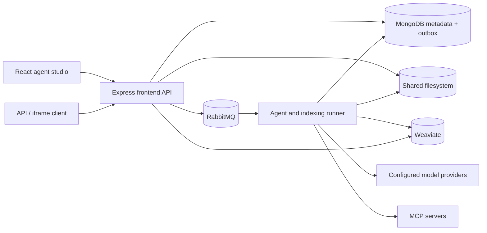

# Agentic Orchestration

A self-hosted studio for agents, MCP tools, and knowledge. Build visual workflows, run agents in a playground, and expose them through an API or an embedded conversation.

The application is self-contained. Its API, runner, studio, configuration, and deployment assets all live in this repository.

## Start

Install Docker with Docker Compose and OpenSSL, then run:

```sh
git clone https://github.com/deepfinery/orchestrator.git
cd orchestrator
./start.sh
```

Open **http://localhost:8088**. Create your local administrator account using the `SETUP_TOKEN` generated in `.env`. There is no default account or password. Subsequent starts use the same configuration and persistent volumes.

`start.sh` generates unique credentials, builds the application, starts Compose, and waits for healthy services. After configuration exists, you can also use:

```sh
docker compose up --build -d --wait
```

For a different port on first launch:

```sh
STUDIO_PORT=8090 ./start.sh
```

Allow approximately 4 GB of available memory for the application stack, plus the memory needed by any locally hosted models. A CPU-only laptop can run the studio with a remote model provider. Ollama or another inference server is configured separately; the project does not download a large model automatically.

## What is included

- **Agent studio:** instructions, descriptions, model choice, explicit tool permissions, multiple MCP connections, knowledge bindings, execution limits, and enable/disable controls.
- **Visual orchestration:** agent steps, explicit MCP tool calls, conditions, parallel agents, and output templates. Drag and connect steps; auto-arrange the graph; edit or export YAML.
- **Runner:** durable RabbitMQ jobs, persisted execution snapshots and traces, bounded agent loops, cancellation, run history, and interval schedules.
- **One tool connector: MCP.** Streamable HTTP or legacy SSE, unauthenticated servers, bearer/API-key authentication, and OAuth discovery, PKCE, dynamic registration or a pre-registered client, and refresh tokens.
- **Model providers:** OpenAI-compatible APIs, Anthropic, Gemini, and Ollama. Model IDs and endpoints are configurable. Model providers are inference services; all external agent tools use MCP.
- **Knowledge bases:** filesystem uploads, asynchronous ingestion, Weaviate hybrid search, source citations in the prompt, and retrieval testing. TXT, Markdown, CSV, JSON, YAML, text PDFs, and DOCX are supported.
- **Local accounts:** MongoDB-backed users and sessions, password hashing, profile editing, administrator-managed accounts, and private resources per account.
- **Integrations:** target-scoped, expiring API keys and revocable iframe links with allowed frame origins.

No provider-specific tool connectors, external account login, website builder, setup wizards, reports, customer management, product/service management, billing, or customer portal are included.

## First agent

1. In **Settings → Model providers**, add a provider, its API base URL, and a chat model ID. Add an embedding model if you want to use that provider for knowledge.
2. In **MCP connections**, save an MCP endpoint. Authorize it if required, then select **Discover tools**.
3. In **Agents**, define instructions, choose a model, and select the exact tools the agent may use. An empty tool selection grants no tool access.
4. Optionally create a **Knowledge base**, upload documents, wait for their `ready` status, and attach it to the agent.
5. Use the **Playground**, or add the agent to a workflow.

The studio starts without API keys. Actual model runs and vector embeddings require a configured provider. Local Ollama needs the selected models pulled in advance.

## Model endpoints

| Type              | Example base URL                                   | Notes                                                                                                                      |
| ----------------- | -------------------------------------------------- | -------------------------------------------------------------------------------------------------------------------------- |
| OpenAI compatible | `https://api.openai.com/v1`                        | Also supports compatible inference services such as vLLM and LM Studio. Supply that service's exact base URL and model ID. |
| Anthropic         | `https://api.anthropic.com/v1`                     | Chat/tool use. Select a different provider for embeddings.                                                                 |
| Gemini            | `https://generativelanguage.googleapis.com/v1beta` | Chat/tool use and configured embedding models. This is unrelated to UI login.                                              |
| Ollama            | `http://host.docker.internal:11434`                | Native Ollama chat and embedding APIs. The host gateway is configured in Compose.                                          |

Private endpoints are denied unless their hostname is explicitly listed in `ALLOWED_PRIVATE_HOSTS`. The default permits `host.docker.internal` and `ollama`. For an MCP server on your network, add its hostname to `.env` and recreate the API and runner:

```sh
docker compose up -d api runner
```

MCP OAuth callback URL: `PUBLIC_URL/api/mcp/oauth/callback`. Configure the public URL before authorizing a server. OAuth here authorizes tools; studio users always use local accounts. Servers without dynamic registration can use a pre-registered client ID and optional client secret. A remote stdio-only MCP server should be exposed through an HTTP/SSE MCP gateway; the application does not execute arbitrary shell commands supplied in the UI.

## API and iframe

Create an API key in **Integrations**, choosing its allowed agent or workflow. Then:

```sh
curl -X POST http://localhost:8088/api/runs \
  -H 'Authorization: Bearer YOUR_API_KEY' \
  -H 'Content-Type: application/json' \
  -H 'Idempotency-Key: a-unique-request-id' \
  -d '{"agentId":"YOUR_AGENT_ID","input":"Summarize the available knowledge."}'
```

The response is `202 Accepted` with an `id`. Poll `GET /api/runs/:id` using the same key. Terminal statuses are `succeeded`, `failed`, `cancelled`, and `interrupted`. Cancel with `POST /api/runs/:id/cancel`. Use `workflowId` instead of `agentId` for workflows.

For iframes, choose **Integrations → Iframe embeds**, select one target, set exact allowed website origins and an expiration, then copy the generated HTML. The capability is carried in the URL fragment and sent as an authorization header by the embedded UI. No third-party login cookie is needed. Treat the embed link as a credential: it can run the selected target until revoked or expired. Allowed frame origins restrict where the UI may be framed; they do not make a copied capability secret.

See [the API reference](docs/api.md) for request shapes and permissions.

## Architecture



| Path            | Purpose                                                                                           |
| --------------- | ------------------------------------------------------------------------------------------------- |
| `apps/api`      | Local authentication, resource APIs, integrations, scheduler, queue dispatcher, static UI hosting |
| `apps/runner`   | RabbitMQ consumer, run leases, execution, document ingestion and deletion                         |
| `apps/studio`   | Trimmed React studio, workflow canvas, playground, knowledge and settings                         |
| `packages/core` | Shared schemas, agent runtime, provider adapters, MCP/OAuth, storage, retrieval, queue            |
| `tests`         | Unit, real-stack integration, fault-injection, and browser tests with test-only provider fixtures |

MongoDB, RabbitMQ, and Weaviate use their community distributions, run locally, and have independent persistent volumes. Only the studio HTTP port is published by the default Compose stack. No AWS, Google account login, S3, Redis, or managed database service is needed.

## Operations and limits

- Keep `.env` backed up with the volumes. In particular, existing encrypted credentials cannot be recovered without `ENCRYPTION_KEY`.
- The `files` volume is mounted at `/data` in both the API and runner. For a mounted shared filesystem, use [compose.shared-fs.yaml](compose.shared-fs.yaml).
- The default HTTP listener binds to loopback. For a server, put a TLS reverse proxy in front of it and set `PUBLIC_URL` to the HTTPS URL. Set `TRUST_PROXY=1` only when there is exactly one trusted proxy.
- Scale runners with `docker compose up -d --scale runner=2`. Keep the same database, broker, Weaviate instance, credentials, and filesystem for all replicas.
- A Mongo run/document record is the durable outbox. Queue deliveries are at least once. Atomic claims prevent two workers from executing the same active run.
- A run interrupted during external work is marked **interrupted**, not automatically replayed. A tool may have acted before the process was lost. Review the trace and start a new run deliberately. This is not an exactly-once guarantee for external side effects.
- Agent tool errors are returned to the model for correction within its turn budget. An explicit workflow tool error fails that run. There is no automatic retry of a potentially mutating MCP tool.
- Workflows use an acyclic execution graph, bounded to 100 steps. Agent reasoning loops are bounded separately. Template bindings support `input`, `last`, and `steps.<id>`; arbitrary code is not evaluated.
- Parallel agent steps wait for all agents. A failed sibling aborts the others' in-flight requests; it cannot undo completed external actions.
- Interval schedules dispatch while the API is running. After downtime, an overdue schedule dispatches once; it does not replay every missed interval.
- Knowledge indexing is retriable and replaces partial document vectors. Changing the embedding configuration of a provider already bound to a knowledge base is blocked; create a new provider/base instead.
- Scanned PDFs/images need OCR before upload. Extraction is limited to 2 million characters and 4,000 chunks per document; oversized documents fail explicitly. The default upload limit is 20 MB.
- Run history and documents persist until you remove them or their volumes. Backups and retention are the installation operator's responsibility.

See [operations](docs/operations.md) for backup and recovery, and [design notes](docs/design.md) for the architecture and execution guarantees.

## Development and verification

Node.js 22 or later is required outside Docker.

```sh
npm ci
npm run typecheck
npm test
npm run build
```

Run the complete isolated-stack suite (creates and removes **test-only** Compose volumes):

```sh
./scripts/test-stack.sh
```

Include Chromium browser tests:

```sh
npx playwright install --with-deps chromium
BROWSER_TESTS=1 ./scripts/test-stack.sh
```

On Linux, `BROWSER_TESTS=container ./scripts/test-stack.sh` runs Chromium in
the matching Playwright container instead of installing browser system libraries.

For UI development against the running local Compose API, use `npm run dev` and
open `http://localhost:5173`. For a non-default API URL, set `DEV_API_URL` and
`DEV_API_ORIGIN` to its reachable endpoint and configured public origin. Direct
API/runner development requires explicitly supplying the configuration in
`packages/core/src/config.ts` and reachable development database/broker URLs.

The fixtures provide deterministic model, MCP, and OAuth endpoints. MongoDB, RabbitMQ, Weaviate, the API, and the runner are real containers. Tests exercise protocol plumbing, queue recovery, and access isolation; hosted models and your particular external MCP services should also be checked with their real credentials before release.

The GitHub Actions workflow builds and tests every push and pull request. Installation credentials are generated locally; `.env`, data, dependency folders, and test artifacts are excluded from version control.

## License

Apache License 2.0. See [LICENSE](LICENSE) and [NOTICE](NOTICE). Third-party packages and container images retain their respective licenses.
