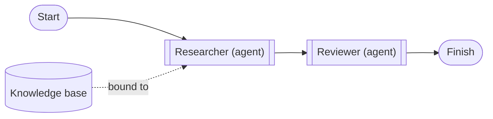
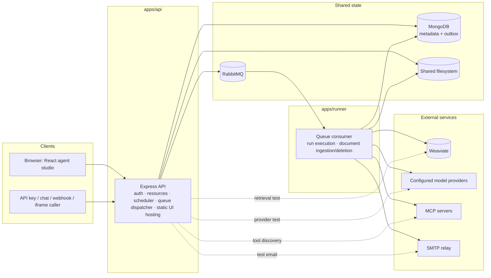
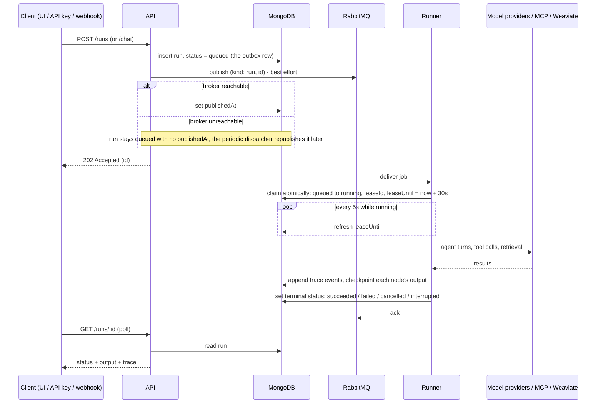
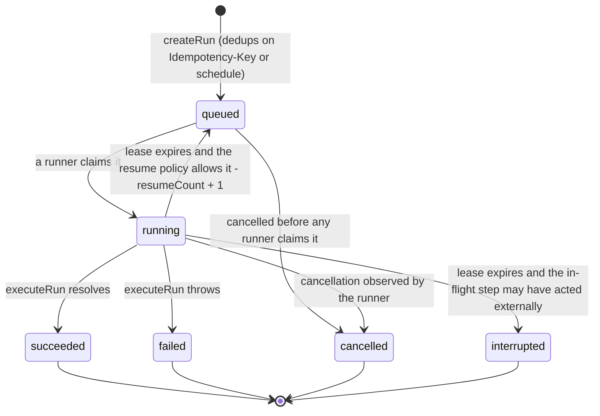
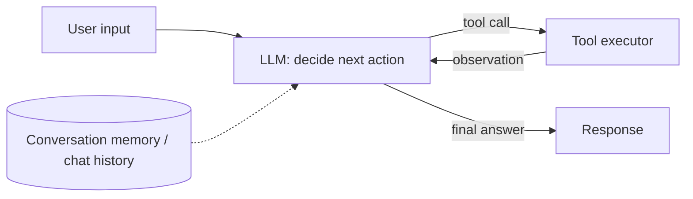
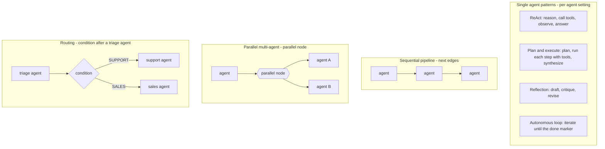

# Agentic Orchestration

A self-hosted studio for AI agents, MCP tools, and knowledge. Build agents from templates, wire them into visual multi-agent workflows, watch every step stream in the playground, and expose the result through an API, a conversation, a webhook, an email, or an embedded chat — all on your own infrastructure.

- **One tool protocol.** Every external capability arrives through MCP: paste a server URL, sign in or add a key, pick the tools each agent may call.
- **Durable by design.** Runs are queued through RabbitMQ, checkpointed in MongoDB, and resumed on another runner if a process dies — without ever blindly replaying a step that may have acted on the outside world.
- **Self-contained.** API, runner, studio, configuration and deployment assets live in this repository. No cloud account, managed database, or external login is required.

## Contents

- [Quick start](#quick-start)
- [What you get](#what-you-get)
- [Concepts](#concepts): [agents and patterns](#agents-and-agentic-patterns) · [workflows](#workflows) · [runs and conversations](#runs-conversations-and-traces)
- [Guides](#guides): [model provider](#1-connect-a-model-provider) · [MCP tools](#2-connect-mcp-tools) · [agents](#3-build-an-agent) · [workflows](#4-start-a-workflow-from-a-template) · [knowledge](#5-knowledge-bases) · [email](#6-outgoing-email) · [API, webhooks, embeds](#7-use-it-from-outside-the-studio)
- [Architecture](#architecture): [components](#components) · [run lifecycle](#run-lifecycle) · [run states](#run-states) · [resilience and idempotency](#resilience-idempotency-and-resume) · [design principles](#design-principles) · [in context](#agentic-architecture-in-context)
- [Configuration](#configuration) · [Operations and limits](#operations-and-limits) · [Upgrade](#upgrade)
- [Development and verification](#development-and-verification) · [License](#license)

## Quick start

Install Docker with Docker Compose and OpenSSL, then run:

```sh
git clone https://github.com/deepfinery/orchestrator.git
cd orchestrator
./start.sh
```

Open **http://localhost:8088** and create the first administrator account with the `SETUP_TOKEN` written to `.env`. There is no default account or password. Later starts reuse the same configuration and persistent volumes:

```sh
docker compose up --build -d --wait      # rebuild and restart after pulling changes
STUDIO_PORT=8090 ./start.sh              # choose a different port on first launch
```

Allow about 4 GB of memory for the stack, plus whatever your locally hosted models need. A CPU-only laptop runs the studio with a remote model provider; Ollama or another inference server is configured separately and no model is downloaded automatically.

## What you get

| Area                | What is included                                                                                                                                                                                                                                                                                     |
| ------------------- | ---------------------------------------------------------------------------------------------------------------------------------------------------------------------------------------------------------------------------------------------------------------------------------------------------- |
| **Agents**          | Seven templates (assistant, researcher, planner, reflective writer, autonomous worker, reviewer, support), four agentic patterns (ReAct, plan-and-execute, reflection, autonomous loop), explicit tool permissions across several MCP servers, knowledge bindings, turn and time limits.             |
| **Workflows**       | Visual canvas with Start/Finish, inline agents, conditions, parallel agents, explicit MCP actions, Email steps, MCP-tool and knowledge cards, bounded cycles, undo/redo, auto layout, YAML view. Seven starters including three multi-agent ones. Every palette insertion is laid out automatically. |
| **Runner**          | Durable RabbitMQ jobs, immutable execution snapshots, per-step checkpoints, automatic resume on a replacement runner under a per-workflow policy, idempotency keys on every tool call, cancellation, schedules.                                                                                      |
| **Playground**      | Saved conversations per agent or workflow, token-by-token streaming, live execution trace and a run-history tab side by side.                                                                                                                                                                        |
| **MCP connector**   | Streamable HTTP or legacy SSE; no auth, API key, or OAuth with PKCE, dynamic registration or a pre-registered client ID (for servers such as Finnhub); discovered tools shown on the connection card with their schemas; every call validated against the schema before it is sent.                  |
| **Model providers** | Guided setup for OpenAI, Anthropic, Gemini, Ollama, or any OpenAI-compatible server; separate chat and embedding models; a connection test that reports the provider's exact error before you save.                                                                                                  |
| **Knowledge bases** | Uploads (TXT, Markdown, CSV, JSON, YAML, text PDF, DOCX), background indexing, Weaviate hybrid search, cited passages in the prompt, retrieval testing.                                                                                                                                              |
| **Outgoing email**  | Workspace SMTP settings (Amazon SES, Google Workspace, SendGrid, Mailgun, Postmark or any relay), `.env` defaults, a test send, and an Email workflow step.                                                                                                                                          |
| **Workspaces**      | Local accounts, administrator-managed teammates, shared resources and run history per tenant, tenant isolation, edit-conflict detection.                                                                                                                                                             |
| **Integrations**    | Target-scoped API keys, conversational API, server-sent event stream per run, authenticated JSON webhooks, revocable iframe embeds with allowed origins.                                                                                                                                             |

Deliberately not included: provider-specific tool catalogs, external account login, website builders, business wizards, reports, CRM, product catalogs, billing, or customer portals.

## Concepts

### Agents and agentic patterns

An **agent** is a model provider, instructions, an allow-list of MCP tools, optional knowledge bases, execution limits, and a **pattern** that decides how it organizes its passes over the model. Tools and knowledge are available in every pattern.

| Pattern              | How it works                                                                                                                                | Use it for                                       |
| -------------------- | ------------------------------------------------------------------------------------------------------------------------------------------- | ------------------------------------------------ |
| **ReAct** (default)  | Each turn the model either calls tools or answers. Tool results feed the next turn, bounded by the agent's turn limit.                      | Assistants, most workflow steps                  |
| **Plan and execute** | One pass writes a short numbered plan without tools; each step then runs with tools and records its result; a final pass writes the answer. | Multi-step research, comparisons, reports        |
| **Reflection**       | Draft, critique as a strict reviewer, revise with tools for verification. One to three rounds.                                              | Writing, analysis, anything that must be checked |
| **Autonomous loop**  | Work in iterations, carrying progress forward, until the agent ends a message with the done marker or hits the iteration limit.             | Long tasks with a clear completion condition     |

Patterns beyond ReAct receive up to four times the agent's turn limit in total model calls. Every pass is visible in the trace as `plan`, `plan_step`, `reflection`, and `iteration` events.

### Workflows

A **workflow** is a graph of steps executed in order from Start to Finish, plus resource cards (MCP tools, knowledge bases) attached to agents. Steps pass results through templates: `{{input}}` is the run input, `{{last}}` the previous step's result, `{{steps.<id>}}` any earlier step, and `{{payload.<field>}}` structured webhook or API data.

| Step        | Behavior                                                                                | Outgoing connections                                       |
| ----------- | --------------------------------------------------------------------------------------- | ---------------------------------------------------------- |
| `start`     | Entry point of the workflow                                                             | one `next`                                                 |
| `agent`     | Runs an agent's pattern; the model chooses when to call its bound MCP tools             | one `next`, plus bottom-port MCP tool / knowledge bindings |
| `tool`      | Makes one fixed MCP call with templated arguments, no model involved                    | one `next`                                                 |
| `parallel`  | Runs 2–8 saved agents concurrently on the same prompt and waits for all                 | one `next`                                                 |
| `email`     | Sends a templated email through the workspace SMTP settings                             | one `next`                                                 |
| `condition` | Evaluates a templated comparison                                                        | `onTrue` and `onFalse`                                     |
| `finish`    | Renders a template from accumulated state and ends the run (`output` is a legacy alias) | none                                                       |

Resource cards never advance execution: an agent's bound tools are available throughout its own turn budget, and the model decides when to call them. Use a `tool` step when a call must happen in a fixed order. One agent can attach several MCP servers and knowledge bases, and one card can serve several agents.

### Runs, conversations and traces

Every trigger — playground, API, conversation, webhook, schedule or embed — creates a **run**: an immutable snapshot of the agents and tool grants at submission time, queued to a runner. The run's **trace** records model turns, tool calls and results, retrieved passages, pattern passes, and step outputs as they happen; the playground shows it live and the Executions page keeps it. A **conversation** keeps server-side history across turns for one target, so follow-up questions work from the studio or the API.

## Guides

### 1. Connect a model provider

**Settings → Model providers → Add provider.** Pick where your models run (OpenAI, Anthropic, Gemini, Ollama, or another OpenAI-compatible server), paste the key, choose a **chat model** and — if this provider will index knowledge — an **embedding model**. **Test connection** checks both against the real endpoint before you save and shows the provider's exact error message if something is wrong.

| Type              | Example base URL                                   | Notes                                                                                                      |
| ----------------- | -------------------------------------------------- | ---------------------------------------------------------------------------------------------------------- |
| OpenAI compatible | `https://api.openai.com/v1`                        | Also vLLM, LM Studio, Azure OpenAI, DeepSeek, Mistral, Groq, OpenRouter. Use the service's exact base URL. |
| Anthropic         | `https://api.anthropic.com/v1`                     | Chat and tool use. No embeddings: pair with another provider for knowledge bases.                          |
| Gemini            | `https://generativelanguage.googleapis.com/v1beta` | Chat, tool use and embeddings with an API key. Unrelated to UI login.                                      |
| Ollama            | `http://host.docker.internal:11434`                | Native chat and embedding APIs. Pull the models first. The host gateway is configured in Compose.          |

Chat models are chosen per agent, so one workflow can mix a fast model with a careful one. A knowledge base is bound to one embedding provider for its lifetime. Streaming is on by default per provider and falls back to a single response when a server ignores the `stream` flag.

### 2. Connect MCP tools

**MCP connections → Connect a server.** Paste the server's MCP endpoint (Streamable HTTP, or legacy SSE), choose no auth, an API key, or **OAuth**. For OAuth, save and click **Authorize**: a window opens for the provider's login, returns to the studio, and tools are discovered automatically. The connection form shows the callback URL (`PUBLIC_URL/api/mcp/oauth/callback`) with a copy button for providers that require registration; providers that publish a fixed client ID (for example Finnhub's remote server at `https://mcp.finnhub.io/mcp`) take it in the **Client ID** field with an empty secret.

Discovered tools appear as chips on the connection card; click one to see its input schema. Agents receive that schema with the tool, and every call is checked against it before it leaves the runner — a wrong enum or missing field comes back to the model as a correctable error instead of an opaque server failure.

Private endpoints are denied unless their hostname is listed in `ALLOWED_PRIVATE_HOSTS` (default: `host.docker.internal,ollama`). A stdio-only MCP server should be exposed through an HTTP/SSE gateway; the studio never runs shell commands from the UI.

### 3. Build an agent

**Agents → Create agent** opens the template chooser. Each template pairs a pattern with instructions written for it; **Start blank** skips it. Adjust the instructions, choose the pattern and its options, pick a model, select the exact tools the agent may call (an empty selection grants nothing), attach knowledge bases, and set turn and time limits. Try it immediately in the **Playground**: conversations are saved per agent, answers stream as they are written, and the right panel switches between the live **Trace** and the run **History**.

### 4. Start a workflow from a template

**Workflows → Create workflow**, then a starter. Each opens a connected canvas you can edit.

| Starter               | Shape                                                  | Agents | Needs               |
| --------------------- | ------------------------------------------------------ | ------ | ------------------- |
| Knowledge research    | Start → Researcher → Finish                            | 1      | a knowledge base    |
| MCP tool assistant    | Start → Tool assistant → Finish                        | 1      | an MCP connection   |
| Research and review   | Start → Researcher → Reviewer → Finish                 | 2      | a knowledge base    |
| Plan, research, write | Start → Planner → Researcher → Writer → Finish         | 3      | an MCP connection   |
| Route to a specialist | Start → Triage → Condition → Specialist A / B → Finish | 3      | nothing             |
| Research and email    | Start → Analyst → Email → Finish                       | 1      | MCP + SMTP settings |
| Blank canvas          | Start → Finish                                         | 0      | nothing             |

On the canvas, click a palette item to insert it (the graph is re-laid out so nothing overlaps) or drag it to a spot of your choice. An agent's left/right ports carry execution; its bottom **Tools** and **Knowledge** ports attach resource cards, and the inspector of any card offers **+ MCP tools** / **+ Knowledge** to add more. Select a connection line and press Delete to remove it. The palette footer sets the step budget and the **resume policy** (see [Resilience](#resilience-idempotency-and-resume)). **Save & test** opens the workflow in the playground.

For example, **Research and review** wires two agents and a knowledge binding like this:



### 5. Knowledge bases

**Knowledge bases → New knowledge base**: name it and choose the embedding provider. Drop files onto the page; each document is indexed in the background and used as soon as it is `ready`. The page shows document, passage and readiness counts, the embedding model in use, and a **Test retrieval** panel that returns the exact passages an agent would receive. Retrieved passages are placed in the agent's system prompt as reference data with source titles, never as instructions.

### 6. Outgoing email

**Settings → Email (SMTP)** configures one outgoing mail server per workspace, with presets for Amazon SES, Google Workspace, SendGrid, Mailgun and Postmark, a **Send test** action, and the same private-network rules as other endpoints. Operators can preconfigure every workspace through `.env` (see [Configuration](#configuration)); settings saved in the studio take precedence.

Email is sent by the **Email** workflow step. Recipients, subject and body are templates (`{{last}}`, `{{steps.analyst}}`, `{{payload.email}}`). Because sending is an external side effect, a run that crashes inside an Email step is not replayed under the default resume policy.

### 7. Use it from outside the studio

Create an API key in **Integrations** for one agent or workflow, then:

```sh
curl -X POST http://localhost:8088/api/runs \
  -H 'Authorization: Bearer YOUR_API_KEY' \
  -H 'Content-Type: application/json' \
  -H 'Idempotency-Key: a-unique-request-id' \
  -d '{"agentId":"YOUR_AGENT_ID","input":"Summarize the available knowledge."}'
```

The response is `202 Accepted` with an `id`. Poll `GET /api/runs/:id`, or open `GET /api/runs/:id/stream` for server-sent events that deliver the status, the trace, and the answer text as it streams. Terminal statuses are `succeeded`, `failed`, `cancelled`, and `interrupted`; cancel with `POST /api/runs/:id/cancel`. Use `workflowId` instead of `agentId` for workflows.

- **Conversations:** `POST /api/chat` with a target and `message` returns a run and a `conversationId`; send the same `conversationId` for follow-ups. `GET /api/conversations?agentId=…` lists the caller's conversations.
- **Webhooks:** **Integrations → Webhooks** creates an authenticated URL. Send JSON with the bearer secret; the chosen field becomes `{{input}}` and every field is available as `{{payload.field}}`. Poll `/api/hooks/:id/runs/:runId` with the same secret. Retries may carry an `Idempotency-Key`.
- **Embeds:** **Integrations → Embedded chat** issues an iframe snippet scoped to one target and your site's origins. Visitors see the conversation only — never traces, prompts or your studio. Treat the link as a credential; revoke it any time.

See [the API reference](docs/api.md) for every request shape and permission.

## Architecture

### Components



| Path            | Purpose                                                                                                                        |
| --------------- | ------------------------------------------------------------------------------------------------------------------------------ |
| `apps/api`      | Local authentication, resource APIs, integrations, email settings, scheduler, queue dispatcher, SSE streams, static UI hosting |
| `apps/runner`   | RabbitMQ consumer, run leases and checkpoints, agent patterns, streaming, document ingestion and deletion                      |
| `apps/studio`   | React studio: canvas, playground, knowledge, connections, settings                                                             |
| `packages/core` | Shared schemas, agent runtime, provider adapters, MCP/OAuth, email, storage, retrieval, queue                                  |
| `tests`         | Unit, real-stack integration, fault-injection, and browser tests with test-only provider/MCP fixtures                          |

The dotted edges are administrative, not execution: the API calls a model provider directly only to verify credentials, calls an MCP server directly only to list its tools, calls Weaviate directly only for the Knowledge Base's retrieval test, and the SMTP relay only for the test email. Every agent turn, workflow step, email send, and document ingestion runs in the runner, reached only through RabbitMQ.

MongoDB, RabbitMQ, and Weaviate use their community distributions, run locally, and have independent persistent volumes. Only the studio HTTP port is published by the default Compose stack.

### Run lifecycle



Streamed model text is buffered into the run's `partial` field a few times a second and cleared when the answer is final; `GET /runs/:id/stream` pushes every change as a server-sent event.

### Run states



### Resilience, idempotency and resume

Six mechanisms cover this, each with a stated limit:

- **Submission idempotency.** `POST /runs` and webhook deliveries accept an `Idempotency-Key`. The same key with the same payload returns the original run; the same key with a different payload is rejected with `409`. Scheduled workflows dedup on a `scheduleKey`, so a scheduler restart cannot double-fire an interval.
- **Durable delivery (the outbox).** A run is written to MongoDB with `status: queued` _before_ anything is published to RabbitMQ. If the broker is down at that instant, the write still succeeds and the periodic dispatcher republishes once the broker is back. The fault-injection test stops the RabbitMQ container mid-submission to verify exactly this.
- **Exclusive execution.** A runner claims a run with an atomic `findOneAndUpdate` (`queued → running`, tagged with a `leaseId`). A duplicate delivery finds the run already claimed and no-ops. A 5-second heartbeat keeps the lease alive; if the runner dies, the lease stops renewing.
- **Checkpointed resume.** Before each workflow step, the runner writes a checkpoint (`cursor`, previous result, step count, per-step attempts); after it, the step's output. When a lease expires, the sweep re-queues the run and a replacement runner rebuilds its scope from the checkpoint and continues at the cursor, so completed steps are never repeated. A `resumed` event names the reason; `MAX_RESUMES` caps crash loops.
- **Side-effect-aware policy.** A checkpoint cannot prove whether the step in flight already acted on the outside world, and MCP defines no generic way to ask. The default `safe` policy therefore resumes only when that step has no external side effects (`start`, `condition`, `finish`, agents without tools) and otherwise fails to `interrupted` with the reason spelled out. Workflows calling idempotent tools can opt into `always`; audited pipelines can choose `never`.
- **Idempotency keys on every tool call.** Each MCP call carries `_meta.idempotencyKey = runId:nodeId:callNumber` so a server that deduplicates on it can make a replay harmless. Servers that ignore `_meta` are unaffected, which is why the default policy stays conservative.

This is the saga shape without pretending to have compensations the tools cannot offer: forward recovery for everything the platform controls, an explicit stop with a reason for the one step it cannot vouch for, and the key an external system needs to close the gap.

### Design principles

- **One tool protocol, not N connectors.** Search, market data, ticketing, files — everything arrives through MCP. One auth model, one discovery mechanism, one place (`toolValidation.ts`) where every call is checked against the server's live schema. A new integration is a new MCP server, not new orchestrator code.
- **The tool loop is explicit and inspectable.** Each turn the model sees the full tool list with schemas; each call is validated locally, dispatched inside a claimed and heartbeating run, and written to the trace as it happens. Schema violations and MCP-side errors return to the model as tool results so it can correct itself within its turn budget instead of killing the run.
- **Bounded everywhere.** Agent turns, per-turn tool calls, pattern passes, workflow step budgets, context size, and wall-clock timeouts are all capped. An agent cannot run away with your token budget or your infrastructure.
- **Least privilege by default.** Tool access is an explicit allow-list per agent; an empty list grants nothing. Provider, MCP and SMTP credentials are write-only, even to administrators. Nothing the model says grants it authorization: which tools exist, which knowledge base is searched, and which tenant's data is reachable are decided by configuration before it runs.
- **Retrieval is a context stage, not a tool the model can misuse.** Knowledge lookups happen before the model sees the prompt, are cited by source, and are labeled as reference data rather than instructions.
- **Tested against real infrastructure.** Integration tests run against real MongoDB, RabbitMQ and Weaviate containers with deterministic MCP/model fixtures, including fault injection: killed containers, expired OAuth tokens, interrupted and resumed runs. A passing suite means the failure mode was exercised, not mocked away.

### Agentic architecture in context

This project does not use LangChain or any agent framework — there is no such dependency, and `packages/core/src/runtime.ts` talks to each model provider's native API directly. It is still useful to place the design against the loop most agent frameworks (LangChain's `AgentExecutor` and its equivalents) converge on:



_A generic ReAct-style agent-executor loop — the common shape behind LangChain and most other agent frameworks, shown as background, not as this repository's own stack._

Frameworks bring a large integration catalog, a shared vocabulary and fast prototyping, at the cost of a fast-moving dependency, an abstraction between you and the provider's actual request, and no opinion about durability, tenancy or credentials. This project takes the other side of that trade: a small execution core purpose-built around the durability, tenancy and tool-validation guarantees above, with MCP as the integration catalog. The patterns it implements map onto the canvas like this:



## Configuration

`start.sh` writes `.env` with unique credentials. Every variable below is read by the API and the runner; recreate them after changes with `docker compose up -d api runner`.

| Variable                                                                           | Default                       | Purpose                                                                                      |
| ---------------------------------------------------------------------------------- | ----------------------------- | -------------------------------------------------------------------------------------------- |
| `PUBLIC_URL`                                                                       | `http://localhost:8088`       | The URL users open; used for OAuth callbacks, webhook URLs and embed links.                  |
| `STUDIO_PORT`, `STUDIO_BIND`                                                       | `8088`, `127.0.0.1`           | Published port and bind address of the studio.                                               |
| `ENCRYPTION_KEY`                                                                   | generated                     | 32 random bytes (hex) that protect stored credentials. Back it up with the volumes.          |
| `SETUP_TOKEN`                                                                      | generated                     | Required once to create the first administrator.                                             |
| `ALLOWED_PRIVATE_HOSTS`                                                            | `host.docker.internal,ollama` | Hostnames on private networks that model, MCP and SMTP endpoints may use.                    |
| `ALLOW_PRIVATE_URLS`                                                               | `false`                       | Allow any private address (development only).                                                |
| `WORKER_CONCURRENCY`                                                               | `2`                           | Jobs a runner replica executes at once.                                                      |
| `MAX_ACTIVE_RUNS`                                                                  | `20`                          | Queued plus running runs allowed per workspace.                                              |
| `MAX_RESUMES`                                                                      | `3`                           | Automatic resumes of a run whose runner died before it is marked interrupted.                |
| `MAX_UPLOAD_MB`                                                                    | `20`                          | Knowledge document upload limit.                                                             |
| `TRUST_PROXY`                                                                      | `0`                           | Set to `1` only behind exactly one trusted reverse proxy.                                    |
| `SMTP_HOST`, `SMTP_PORT`, `SMTP_SECURE`, `SMTP_USER`, `SMTP_PASSWORD`, `SMTP_FROM` | unset                         | Installation-wide email defaults (for example Amazon SES); workspace settings override them. |

MongoDB, RabbitMQ and Weaviate credentials are generated into `.env` and consumed by Compose. The `files` volume is mounted at `/data` in the API and runner; use [compose.shared-fs.yaml](compose.shared-fs.yaml) for a mounted shared filesystem. Scale runners with `docker compose up -d --scale runner=2`, keeping the same database, broker, Weaviate instance, credentials and filesystem for every replica.

## Operations and limits

- Keep `.env` backed up with the volumes. Encrypted credentials cannot be recovered without `ENCRYPTION_KEY`.
- The default HTTP listener binds to loopback. For a server, put a TLS reverse proxy in front and set `PUBLIC_URL` to the HTTPS URL.
- A Mongo run record is the durable outbox. Queue deliveries are at least once; atomic claims prevent two workers from executing the same active run.
- A run whose runner dies resumes from its checkpoint when the in-flight step had no external side effects (`resumePolicy: safe`, the default). A run interrupted during external work is marked **interrupted**, not replayed. Review its trace before starting a new run. This is not an exactly-once guarantee for external side effects.
- Agent tool errors, including arguments that fail the tool's schema, return to the model for correction. An explicit workflow tool error fails that run. No potentially mutating MCP tool is retried automatically.
- Workflows have one Start and at least one Finish, every step needs a path to Finish, and cycles are bounded by the step budget (default 100, maximum 500). Agent turns and timeouts are bounded separately. Templates are not code: only `input`, `last`, `steps.<id>` and `payload.<field>` are evaluated.
- Parallel steps wait for all agents; a failed sibling aborts the others' in-flight requests but cannot undo completed external actions.
- Interval schedules dispatch while the API is running; after downtime an overdue schedule fires once.
- Knowledge indexing is retriable and replaces partial vectors. A provider's embedding configuration cannot change while a knowledge base uses it. Scanned PDFs need OCR before upload; extraction stops at 2 million characters or 4,000 chunks per document.
- Run history and documents persist until you remove them or their volumes. Backups and retention are the operator's responsibility.

See [operations](docs/operations.md) for backup and recovery and [design notes](docs/design.md) for execution guarantees.

## Upgrade

Back up your configuration and volumes, then run `git pull --ff-only` and `./start.sh` from your clone. Existing private accounts keep separate workspaces and their data. See [upgrade details](docs/operations.md#upgrading-to-02).

## Development and verification

Node.js 22 or later is required outside Docker.

```sh
npm ci
npm run typecheck
npm test
npm run build
```

Run the complete isolated-stack suite (creates and removes **test-only** Compose volumes):

```sh
./scripts/test-stack.sh
```

Include Chromium browser tests with `BROWSER_TESTS=1 ./scripts/test-stack.sh` after `npx playwright install --with-deps chromium`, or `BROWSER_TESTS=container ./scripts/test-stack.sh` on Linux to use the matching Playwright container.

For UI development against the running local Compose API, use `npm run dev` and open `http://localhost:5173`; set `DEV_API_URL` and `DEV_API_ORIGIN` for a non-default API. The fixtures provide deterministic model, MCP, OAuth and (JSON-transport) email endpoints; MongoDB, RabbitMQ, Weaviate, the API and the runner are real containers. Tests cover protocol plumbing, streaming, agentic patterns, queue recovery and resume, email, and access isolation; hosted models and your particular MCP services should also be checked with their real credentials before release.

The GitHub Actions workflow builds and tests every push and pull request. Installation credentials are generated locally; `.env`, data, dependency folders and test artifacts are excluded from version control.

## License

Apache License 2.0. See [LICENSE](LICENSE) and [NOTICE](NOTICE). Third-party packages and container images retain their respective licenses.
