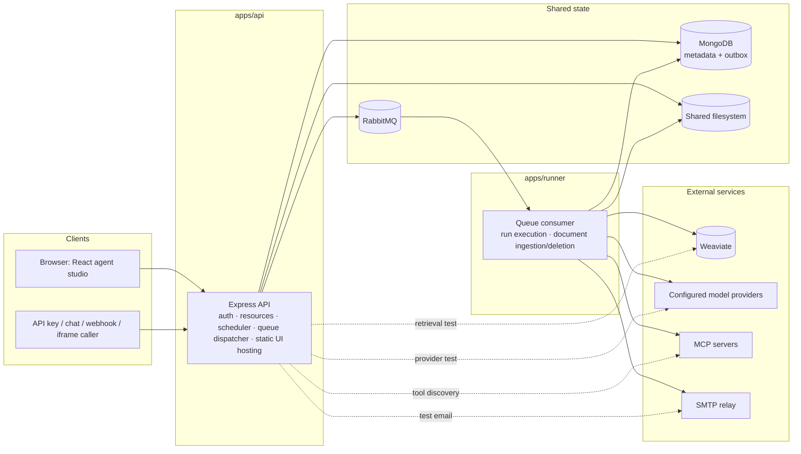
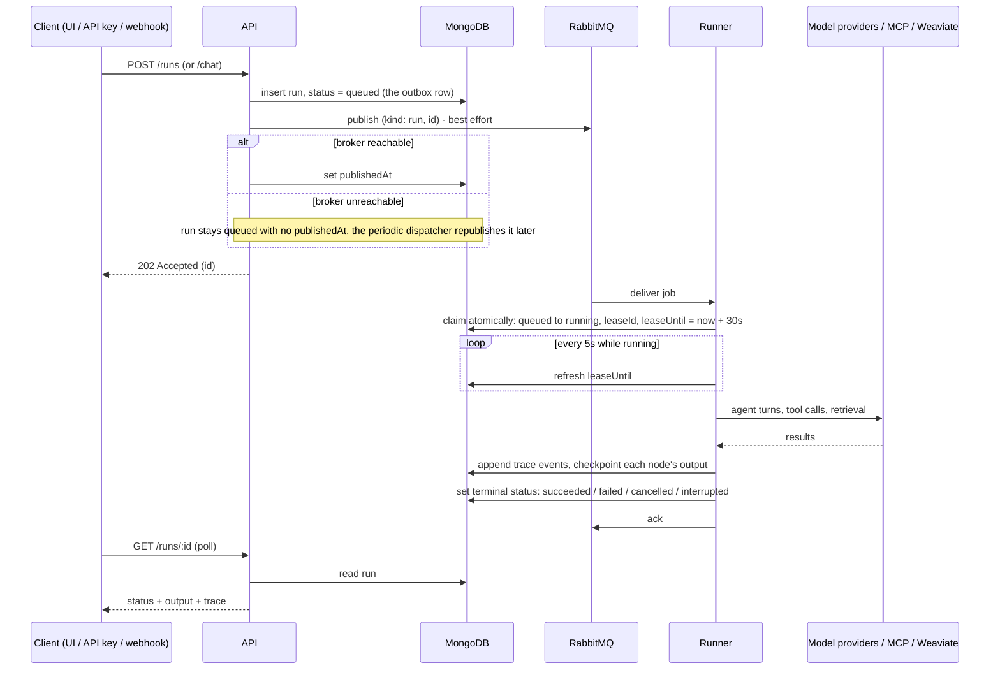
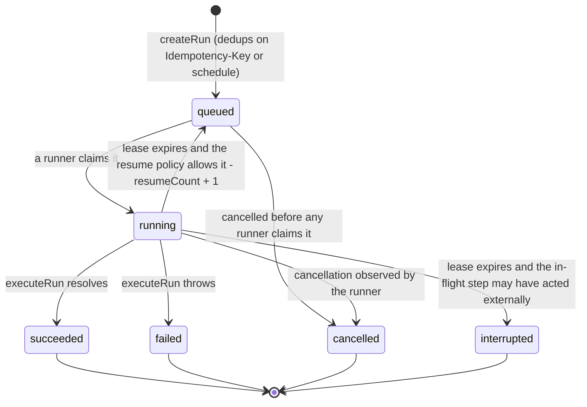
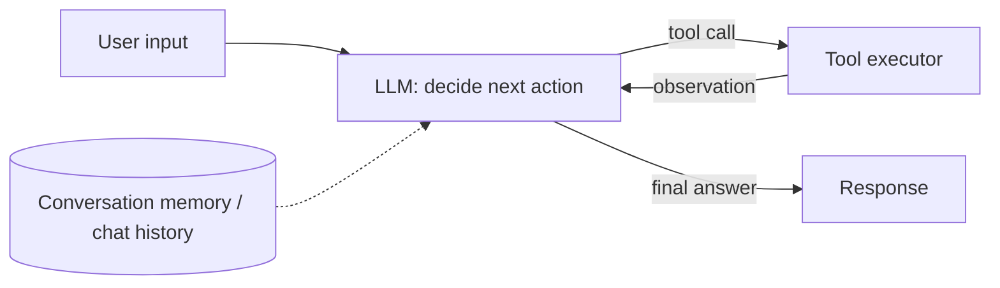
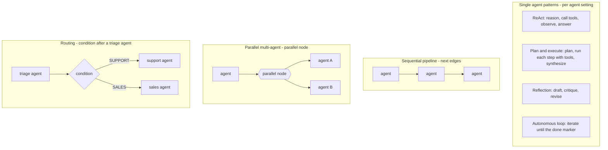

# OpenHarness

A self-hosted studio for AI agents, MCP tools, and knowledge. Build agents from templates, wire them into visual multi-agent workflows, watch every step stream in the playground, and expose the result through an API, a conversation, a webhook, an email, or an embedded chat — all on your own infrastructure.

- **One tool protocol.** Every external capability arrives through MCP: paste a server URL, sign in or add a key, pick the tools each agent may call.
- **Durable by design.** Runs are queued through RabbitMQ, checkpointed in MongoDB, and resumed on another runner if a process dies — without ever blindly replaying a step that may have acted on the outside world.
- **Self-contained.** API, runner, studio, configuration and deployment assets live in this repository. No cloud account, managed database, or external login is required.

## Contents

- [Quick start](#quick-start)
- [What you get](#what-you-get)
- [Concepts](#concepts): [agents and patterns](#agents-and-agentic-patterns) · [workflows](#workflows) · [runs and conversations](#runs-conversations-and-traces)
- [Guides](#guides): [model provider](#1-connect-a-model-provider) · [MCP tools](#2-connect-mcp-tools) · [agents](#3-configure-an-agent) · [workflows](#4-start-a-workflow-from-a-template) · [knowledge](#5-knowledge-bases) · [email](#6-outgoing-email) · [skills](#7-give-agents-skills) · [machines](#7b-operate-a-machine) · [schedules](#8-run-it-on-a-schedule) · [API, webhooks, embeds](#9-use-it-from-outside-the-studio)
- [Architecture](#architecture): [components](#components) · [run lifecycle](#run-lifecycle) · [run states](#run-states) · [resilience and idempotency](#resilience-idempotency-and-resume) · [design principles](#design-principles) · [in context](#agentic-architecture-in-context)
- [Configuration](#configuration) · [Operations and limits](#operations-and-limits) · [Upgrade](#upgrade)
- [Development and verification](#development-and-verification) · [License](#license)

## Quick start

Install Docker with Docker Compose and OpenSSL, then run:

```sh
git clone https://github.com/deepfinery/orchestrator.git
cd orchestrator
./start.sh
```

Open **http://localhost:8088** and create the first administrator account with the `SETUP_TOKEN` written to `.env`. There is no default account or password. Later starts reuse the same configuration and persistent volumes:

```sh
docker compose up --build -d --wait      # rebuild and restart after pulling changes
STUDIO_PORT=8090 ./start.sh              # choose a different port on first launch
```

Allow about 4 GB of memory for the stack, plus whatever your locally hosted models need. A CPU-only laptop runs the studio with a remote model provider; Ollama or another inference server is configured separately and no model is downloaded automatically.

## What you get

| Area                | What is included                                                                                                                                                                                                                                                                                                                     |
| ------------------- | ------------------------------------------------------------------------------------------------------------------------------------------------------------------------------------------------------------------------------------------------------------------------------------------------------------------------------------ |
| **Agents**          | Agents live on the workflow canvas as cards: instructions, model, an effort level (light, medium, high, extra high, max or auto) that sets loop and token budgets, one of four agentic patterns (ReAct, plan-and-execute, reflection, autonomous loop), seven templates, explicit tool permissions, knowledge bindings.              |
| **Workflows**       | Visual designer with a thin toolbox that lists your MCP servers and knowledge bases, drag-and-drop onto the canvas or straight onto an agent, settings in popups instead of a side panel, conditions, parallel agent groups, explicit MCP actions, Email steps, bounded cycles, undo/redo, YAML view.                                |
| **Runner**          | Durable RabbitMQ jobs, immutable execution snapshots, per-step checkpoints, automatic resume on a replacement runner under a per-workflow policy, idempotency keys on every tool call, context-window compaction with automatic recovery from provider limit errors, cancellation.                                                   |
| **Schedules**       | Run a workflow every N minutes, hourly, daily or weekly at a wall-clock time in your time zone; deduplicated so a restart never double-fires.                                                                                                                                                                                        |
| **Skills**          | A workspace library of skills — a name, a one-line “when to use it”, and full instructions. Give an agent several; it sees only the descriptions, loads the matching skill with a built-in `load_skill` tool, and follows it. Skills are snapshotted per run and each load appears in the trace.                                     |
| **Machines**        | Register Linux hosts, containers, Windows machines and Chrome browsers that have no public IP: each runs a connector that dials out to the bundled gateway. Pick a machine in the playground and the workflow's agents get its tools (`run_command`, files, processes …) with per-machine allow-lists, audit and optional approvals. |
| **Playground**      | The workflow selector sits in the top bar; saved conversations per workflow, token-by-token streaming, live execution trace and a run-history tab side by side.                                                                                                                                                                      |
| **MCP connector**   | Streamable HTTP or legacy SSE; no auth, API key, or OAuth with PKCE, dynamic registration or a pre-registered client ID (for servers such as Finnhub); discovered tools shown on the connection card with their schemas; every call validated against the schema before it is sent.                                                  |
| **Model providers** | Guided setup for OpenAI, Anthropic, Gemini, Ollama, or any OpenAI-compatible server; a workspace default provider that new agents start with; separate chat and embedding models; a connection test that reports the provider's exact error before you save.                                                                         |
| **Knowledge bases** | A notebook view: write Markdown notes in place (indexed on every save) or upload TXT, Markdown, CSV, JSON, YAML, text PDF and DOCX; background indexing, Weaviate hybrid search, cited passages in the prompt, an **Ask** dialog that shows the exact passages an agent would get.                                                   |
| **Outgoing email**  | Workspace SMTP settings (Amazon SES, Google Workspace, SendGrid, Mailgun, Postmark or any relay), `.env` defaults, a test send, and an Email workflow step.                                                                                                                                                                          |
| **Workspaces**      | Local accounts, administrator-managed teammates, shared resources and run history per tenant, tenant isolation, edit-conflict detection.                                                                                                                                                                                             |
| **Integrations**    | Target-scoped API keys, conversational API, server-sent event stream per run, authenticated JSON webhooks, revocable iframe embeds with allowed origins.                                                                                                                                                                             |

Deliberately not included: provider-specific tool catalogs, external account login, website builders, business wizards, reports, CRM, product catalogs, billing, or customer portals.

## Concepts

### Agents and agentic patterns

An **agent** is a card on a workflow canvas: a model provider, instructions, an allow-list of MCP tools, optional knowledge bases, an **effort level**, and a **pattern** that decides how it organizes its passes over the model. Tools and knowledge are available in every pattern. There is no separate agent registry to maintain; a one-agent workflow (Start → Agent → Finish) is the simplest assistant.

| Effort         | Turns per pass                                                                                                                                                                   | Token budget | Time limit | Plan steps | Critique rounds | Loop iterations |
| -------------- | -------------------------------------------------------------------------------------------------------------------------------------------------------------------------------- | ------------ | ---------- | ---------- | --------------- | --------------- |
| **Light**      | 4                                                                                                                                                                                | 30k          | 90 s       | 3          | 1               | 2               |
| **Medium**     | 12                                                                                                                                                                               | 120k         | 5 min      | 5          | 1               | 3               |
| **High**       | 24                                                                                                                                                                               | 400k         | 10 min     | 8          | 2               | 6               |
| **Extra high** | 36                                                                                                                                                                               | 1M           | 15 min     | 8          | 3               | 8               |
| **Max**        | 40                                                                                                                                                                               | 5M           | 15 min     | 8          | 3               | 10              |
| **Auto**       | light, medium or high per request: light for short requests without tools, medium when tools are attached or the pattern makes several passes, high for long requests with tools |

Choosing a level sets these budgets in one move; **Limits** in the agent settings still allow individual overrides, including the token budget. The **loop budget** is the number of model turns per pass (multi-pass patterns get up to four passes). The **token budget** counts prompt and completion tokens across the whole run — from the provider's usage report when it sends one, otherwise estimated. When it runs out the agent gets one final call without tools and must answer with what it has; the trace shows a `budget_exhausted` event (and, for auto, an `effort` event naming the level chosen and why).

| Pattern              | How it works                                                                                                                                | Use it for                                       |
| -------------------- | ------------------------------------------------------------------------------------------------------------------------------------------- | ------------------------------------------------ |
| **ReAct** (default)  | Each turn the model either calls tools or answers. Tool results feed the next turn, bounded by the agent's turn limit.                      | Assistants, most workflow steps                  |
| **Plan and execute** | One pass writes a short numbered plan without tools; each step then runs with tools and records its result; a final pass writes the answer. | Multi-step research, comparisons, reports        |
| **Reflection**       | Draft, critique as a strict reviewer, revise with tools for verification. One to three rounds.                                              | Writing, analysis, anything that must be checked |
| **Autonomous loop**  | Work in iterations, carrying progress forward, until the agent ends a message with the done marker or hits the iteration limit.             | Long tasks with a clear completion condition     |

Patterns beyond ReAct receive up to four times the agent's turn limit in total model calls. Every pass is visible in the trace as `plan`, `plan_step`, `reflection`, and `iteration` events.

### Workflows

A **workflow** is a graph of steps executed in order from Start to Finish, plus resource cards (MCP tools, knowledge bases) attached to agents. Steps pass results through templates: `{{input}}` is the run input, `{{last}}` the previous step's result, `{{steps.<id>}}` any earlier step, and `{{payload.<field>}}` structured webhook or API data.

| Step        | Behavior                                                                                  | Outgoing connections                                         |
| ----------- | ----------------------------------------------------------------------------------------- | ------------------------------------------------------------ |
| `start`     | Entry point of the workflow                                                               | one `next`                                                   |
| `agent`     | Runs an agent's pattern; the model chooses when to call its bound MCP tools               | one `next`, plus bottom-port MCP tool / knowledge bindings   |
| `tool`      | Makes one fixed MCP call with templated arguments, no model involved                      | one `next`                                                   |
| `parallel`  | Runs up to 8 agent cards from the same workflow concurrently on one prompt, waits for all | one `next`, plus a bottom **Runs** port to its member agents |
| `email`     | Sends a templated email through the workspace SMTP settings                               | one `next`                                                   |
| `condition` | Evaluates a templated comparison                                                          | `onTrue` and `onFalse`                                       |
| `finish`    | Renders a template from accumulated state and ends the run (`output` is a legacy alias)   | none                                                         |

Resource cards never advance execution: an agent's bound tools are available throughout its own turn budget, and the model decides when to call them. Use a `tool` step when a call must happen in a fixed order. One agent can attach several MCP servers and knowledge bases, and one card can serve several agents.

### Runs, conversations and traces

Every trigger — playground, API, conversation, webhook, schedule or embed — creates a **run**: an immutable snapshot of the agents and tool grants at submission time, queued to a runner. The run's **trace** records model turns, tool calls and results, retrieved passages, pattern passes, and step outputs as they happen; the playground shows it live and the Executions page keeps it. A **conversation** keeps server-side history across turns for one target, so follow-up questions work from the studio or the API.

## Guides

### 1. Connect a model provider

**Settings → Model providers → Add provider.** Pick where your models run (OpenAI, Anthropic, Gemini, Ollama, or another OpenAI-compatible server), paste the key, choose a **chat model** and — if this provider will index knowledge — an **embedding model**. **Test connection** checks both against the real endpoint before you save and shows the provider's exact error message if something is wrong.

| Type              | Example base URL                                   | Notes                                                                                                      |
| ----------------- | -------------------------------------------------- | ---------------------------------------------------------------------------------------------------------- |
| OpenAI compatible | `https://api.openai.com/v1`                        | Also vLLM, LM Studio, Azure OpenAI, DeepSeek, Mistral, Groq, OpenRouter. Use the service's exact base URL. |
| Anthropic         | `https://api.anthropic.com/v1`                     | Chat and tool use. No embeddings: pair with another provider for knowledge bases.                          |
| Gemini            | `https://generativelanguage.googleapis.com/v1beta` | Chat, tool use and embeddings with an API key. Unrelated to UI login.                                      |
| Ollama            | `http://host.docker.internal:11434`                | Native chat and embedding APIs. Pull the models first. The host gateway is configured in Compose.          |

Mark one provider as the **default** (Settings → Model providers → Make default): every new agent card starts with it, and each agent can still pick another, so one workflow can mix a fast model with a careful one. A knowledge base is bound to one embedding provider for its lifetime. Streaming is on by default per provider and falls back to a single response when a server ignores the `stream` flag.

Each provider also has a **context window** (default 128k tokens, under Advanced). Before every model call the runner trims the conversation to fit — older tool results first, then completed turns, never the current question or a tool call without its result. If a provider still rejects a request with a context-length error (the familiar _"maximum context length is 32768 tokens"_), the runner reads the real limit from the message, stores it on the provider, compacts harder and retries; the trace records a `context_compacted` event. Long multi-turn conversations therefore keep working instead of failing with HTTP 400.

### 2. Connect MCP tools

**MCP connections → Connect a server.** Paste the server's MCP endpoint (Streamable HTTP, or legacy SSE), choose no auth, an API key, or **OAuth**. For OAuth, save and click **Authorize**: a window opens for the provider's login, returns to the studio, and tools are discovered automatically. The connection form shows the callback URL (`PUBLIC_URL/api/mcp/oauth/callback`) with a copy button for providers that require registration; providers that publish a fixed client ID (for example Finnhub's remote server at `https://mcp.finnhub.io/mcp`) take it in the **Client ID** field with an empty secret.

Discovered tools appear as chips on the connection card; click one to see its input schema. Agents receive that schema with the tool, and every call is checked against it before it leaves the runner — a wrong enum or missing field comes back to the model as a correctable error instead of an opaque server failure.

Private endpoints are denied unless their hostname is listed in `ALLOWED_PRIVATE_HOSTS` (default: `host.docker.internal,ollama`). A stdio-only MCP server should be exposed through an HTTP/SSE gateway; the studio never runs shell commands from the UI.

### 3. Configure an agent

Agents are configured where they run: double-click an agent card (or its gear icon, or **Settings** in the selection bar) to open its settings. Pick a model (the workspace default is preselected), an **effort** level, a template to start the instructions from, the pattern and its options, and the message the agent receives (`{{input}}`, `{{last}}`, `{{steps.id}}`). **Tools & knowledge** lists what is attached and adds more. Try the workflow in the **Playground**: conversations are saved per workflow, answers stream as they are written, and the right panel switches between the live **Trace** and the run **History**.

### 4. Start a workflow from a template

**Workflows → Create workflow**, then a starter. Each opens a connected canvas you can edit.

| Starter               | Shape                                                  | Agents | Needs               |
| --------------------- | ------------------------------------------------------ | ------ | ------------------- |
| Knowledge research    | Start → Researcher → Finish                            | 1      | a knowledge base    |
| MCP tool assistant    | Start → Tool assistant → Finish                        | 1      | an MCP connection   |
| Research and review   | Start → Researcher → Reviewer → Finish                 | 2      | a knowledge base    |
| Plan, research, write | Start → Planner → Researcher → Writer → Finish         | 3      | an MCP connection   |
| Route to a specialist | Start → Triage → Condition → Specialist A / B → Finish | 3      | nothing             |
| Research and email    | Start → Analyst → Email → Finish                       | 1      | MCP + SMTP settings |
| Blank canvas          | Start → Finish                                         | 0      | nothing             |

The designer has a thin **toolbox** on the left and nothing on the right: every setting opens in a popup.

- **Steps** (agent, condition, parallel agents, MCP action, email, finish): click to insert after the selected step, or drag to a spot on the canvas.
- **MCP tools** lists your connected servers with their tool counts; **Knowledge** lists your knowledge bases. Drag one **onto an agent card** to attach it to that agent (all discovered tools are granted to begin with — trim them in the card's settings), or onto empty canvas to attach it to the selected agent. The **+** next to each heading connects a new server or creates a knowledge base without leaving the canvas.
- Double-click any card, click its gear, or press Enter to open its settings; the floating selection bar offers **Settings** and delete. Select a connection line to disconnect it.
- **Settings** in the header holds the description, step budget, **resume policy** (see [Resilience](#resilience-idempotency-and-resume)) and the **schedule**; **Use in your app** shows the exact API calls for this workflow.
- A **Parallel agents** step points at agent cards in the same workflow (its bottom **Runs** port, or checkboxes in its settings); **New agent in this group** adds one.

**Save & test** opens the workflow in the playground.

For example, **Research and review** wires two agents and a knowledge binding like this:


### 5. Knowledge bases

**Knowledge → New knowledge base**: name it and choose the embedding provider. The page then works like a notebook: knowledge bases on the left, files in the middle, the open file on the right.

- **New note** opens an editor. Write Markdown, press **Save** (or ⌘S / Ctrl+S); the note is stored as a `.md` document and indexed in the background, so agents can search it a few seconds later. Reopen a note to edit it; every save re-indexes.
- **Upload** or drop files anywhere on the panel (TXT, Markdown, CSV, JSON, YAML, text PDF, DOCX). Text files open in the editor too; PDFs and DOCX show their status and a download link.
- **Ask** searches the knowledge base and returns the exact passages an agent would receive. Retrieved passages are placed in the agent's system prompt as reference data with source titles, never as instructions.

On the canvas, drag the knowledge base from the toolbox onto an agent to give it access.

### 6. Outgoing email

**Settings → Email (SMTP)** configures one outgoing mail server per workspace, with presets for Amazon SES, Google Workspace, SendGrid, Mailgun and Postmark, a **Send test** action, and the same private-network rules as other endpoints. Operators can preconfigure every workspace through `.env` (see [Configuration](#configuration)); settings saved in the studio take precedence.

Email is sent by the **Email** workflow step. Recipients, subject and body are templates (`{{last}}`, `{{steps.analyst}}`, `{{payload.email}}`). Because sending is an external side effect, a run that crashes inside an Email step is not replayed under the default resume policy.

### 6b. Give a workflow a knowledge workspace

In **Workflow settings → Knowledge workspace**, pick a knowledge base. The workflow's agents then search it (`kb_search`), read only what they need (`kb_read`), and record findings, decisions with their reasons, and feedback (`kb_write`) as notes in folders such as `research/` and `decisions/`. Large tool results are saved there too, and the agent keeps a summary. See [docs/knowledge-workspace.md](docs/knowledge-workspace.md).

### 7. Give agents skills

**Skills → New skill**: name it, write one line saying _when_ it applies (“Use when someone reports an outage or error spike”), and the instructions to follow — steps, checklists, output formats, examples. In any agent's settings, **Skills** lists the library; tick as many as the agent should have, or create one in place.

At run time the agent's system prompt lists only each skill's name and description, and the agent gets a built-in `load_skill` tool. When a request matches, the model loads that skill's full instructions and follows them; when nothing matches, no skill is loaded. This keeps prompts short with many skills attached. Each load is recorded as a `skill_loaded` trace event, skills are snapshotted when the run is accepted (editing one never changes a run in flight), disabled skills are not offered, and a skill cannot be deleted while an agent uses it.

### 7b. Operate a machine

**Machines → Add machine** registers a Linux host, a container, a Windows machine or a Chrome browser.
Choose the tools the agent may use (deny by default; tools that change state are marked **acts**), click
**Create token**, and paste the shown install command on the machine — a systemd service, a `docker run`, or
the Windows/Chrome connector. The machine dials **out** to the gateway (`GATEWAY_PUBLIC_URL`), so it needs no
public IP; the dialog turns green when it connects.

Then, in the **Playground**, pick a workflow and a machine in the top bar. Every agent in the run receives
the machine's tools and an instruction naming it, and each command and result shows up in the trace. Machines
also appear in the designer toolbox under **Machines** for workflows that should always use a specific one,
and the API takes `"deviceId"` on `/api/runs` and `/api/chat`.

Details, hardening and troubleshooting: [INSTALL.md](docs/INSTALL.md), [SECURITY.md](docs/SECURITY.md),
[ARCHITECTURE.md](docs/ARCHITECTURE.md), [PROTOCOL.md](docs/PROTOCOL.md).

### 8. Run it on a schedule

**Settings** in the workflow header → **Run on a schedule**. Choose every minute, every 5/15/30 minutes, hourly, every 6 hours, **every day at a time**, **every week on a weekday at a time**, or a custom interval in minutes. Daily and weekly schedules use the time zone of your browser (changeable), including daylight-saving changes. Set the message the workflow receives; the next run time is shown once saved. Scheduled runs appear in **Executions** with trigger `schedule` and are deduplicated per slot, so an API restart never fires the same slot twice.

### 9. Use it from outside the studio

**Use in your app** in the workflow header shows the exact calls for that workflow. Create an API key in **Integrations** for the workflow, then:

```sh
curl -X POST http://localhost:8088/api/runs \
  -H 'Authorization: Bearer YOUR_API_KEY' \
  -H 'Content-Type: application/json' \
  -H 'Idempotency-Key: a-unique-request-id' \
  -d '{"workflowId":"YOUR_WORKFLOW_ID","input":"Summarize the available knowledge."}'
```

The response is `202 Accepted` with an `id`. Poll `GET /api/runs/:id`, or open `GET /api/runs/:id/stream` for server-sent events that deliver the status, the trace, and the answer text as it streams. Terminal statuses are `succeeded`, `failed`, `cancelled`, and `interrupted`; cancel with `POST /api/runs/:id/cancel`.

- **Conversations:** `POST /api/chat` with a target and `message` returns a run and a `conversationId`; send the same `conversationId` for follow-ups. `GET /api/conversations?workflowId=…` lists the caller's conversations.
- **Webhooks:** **Integrations → Webhooks** creates an authenticated URL. Send JSON with the bearer secret; the chosen field becomes `{{input}}` and every field is available as `{{payload.field}}`. Poll `/api/hooks/:id/runs/:runId` with the same secret. Retries may carry an `Idempotency-Key`.
- **Embeds:** **Integrations → Embedded chat** issues an iframe snippet scoped to one target and your site's origins. Visitors see the conversation only — never traces, prompts or your studio. Treat the link as a credential; revoke it any time.

- **Open Harness API:** OpenHarness implements the open [Open Harness API](https://github.com/jeffrschneider/OpenHarness) under `/openharness/v1`, so clients written for that spec can drive it. An administrator creates a workspace key (`oh_sk_…`) under **Integrations → API key**. The capability manifest at `/openharness/v1/harnesses/openharness/capabilities` lists what is supported; see [the adapter guide](docs/openharness-api.md).

See [the API reference](docs/api.md) for every request shape and permission.

## Architecture

### Components



| Path              | Purpose                                                                                                                                                                        |
| ----------------- | ------------------------------------------------------------------------------------------------------------------------------------------------------------------------------ |
| `apps/api`        | Local authentication, resource APIs, integrations, email settings, scheduler, queue dispatcher, SSE streams, static UI hosting                                                 |
| `gateway`         | Device gateway: machines dial in over WebSocket; the orchestrator reaches each as a Streamable HTTP MCP server (`/mcp/{device}`), plus registry, allow-lists, audit, approvals |
| `connector-core`  | Shared connector library: WebSocket MCP transports, framing, reconnect/resume, local policy (command allow-list, path jail, caps), audit                                       |
| `connector-linux` | The Linux/container connector: MCP server with `run_command`, file, search, system and process tools; systemd unit, install script, Docker image                               |
| `apps/runner`     | RabbitMQ consumer, run leases and checkpoints, agent patterns, streaming, document ingestion and deletion                                                                      |
| `apps/studio`     | React studio: canvas, playground, knowledge, connections, settings                                                                                                             |
| `packages/core`   | Shared schemas, agent runtime, provider adapters, MCP/OAuth, email, storage, retrieval, queue                                                                                  |
| `tests`           | Unit, real-stack integration, fault-injection, and browser tests with test-only provider/MCP fixtures                                                                          |

The dotted edges are administrative, not execution: the API calls a model provider directly only to verify credentials, calls an MCP server directly only to list its tools, calls Weaviate directly only for the Knowledge Base's retrieval test, and the SMTP relay only for the test email. Every agent turn, workflow step, email send, and document ingestion runs in the runner, reached only through RabbitMQ.

MongoDB, RabbitMQ, and Weaviate use their community distributions, run locally, and have independent persistent volumes. Only the studio HTTP port is published by the default Compose stack.

### Run lifecycle



Streamed model text is buffered into the run's `partial` field a few times a second and cleared when the answer is final; `GET /runs/:id/stream` pushes every change as a server-sent event.

### Run states



### Resilience, idempotency and resume

Six mechanisms cover this, each with a stated limit:

- **Submission idempotency.** `POST /runs` and webhook deliveries accept an `Idempotency-Key`. The same key with the same payload returns the original run; the same key with a different payload is rejected with `409`. Scheduled workflows dedup on a `scheduleKey`, so a scheduler restart cannot double-fire an interval.
- **Durable delivery (the outbox).** A run is written to MongoDB with `status: queued` _before_ anything is published to RabbitMQ. If the broker is down at that instant, the write still succeeds and the periodic dispatcher republishes once the broker is back. The fault-injection test stops the RabbitMQ container mid-submission to verify exactly this.
- **Exclusive execution.** A runner claims a run with an atomic `findOneAndUpdate` (`queued → running`, tagged with a `leaseId`). A duplicate delivery finds the run already claimed and no-ops. A 5-second heartbeat keeps the lease alive; if the runner dies, the lease stops renewing.
- **Checkpointed resume.** Before each workflow step, the runner writes a checkpoint (`cursor`, previous result, step count, per-step attempts); after it, the step's output. When a lease expires, the sweep re-queues the run and a replacement runner rebuilds its scope from the checkpoint and continues at the cursor, so completed steps are never repeated. A `resumed` event names the reason; `MAX_RESUMES` caps crash loops.
- **Side-effect-aware policy.** A checkpoint cannot prove whether the step in flight already acted on the outside world, and MCP defines no generic way to ask. The default `safe` policy therefore resumes only when that step has no external side effects (`start`, `condition`, `finish`, agents without tools) and otherwise fails to `interrupted` with the reason spelled out. Workflows calling idempotent tools can opt into `always`; audited pipelines can choose `never`.
- **Idempotency keys on every tool call.** Each MCP call carries `_meta.idempotencyKey = runId:nodeId:callNumber` so a server that deduplicates on it can make a replay harmless. Servers that ignore `_meta` are unaffected, which is why the default policy stays conservative.

This is the saga shape without pretending to have compensations the tools cannot offer: forward recovery for everything the platform controls, an explicit stop with a reason for the one step it cannot vouch for, and the key an external system needs to close the gap.

### Design principles

- **One tool protocol, not N connectors.** Search, market data, ticketing, files — everything arrives through MCP. One auth model, one discovery mechanism, one place (`toolValidation.ts`) where every call is checked against the server's live schema. A new integration is a new MCP server, not new orchestrator code.
- **The tool loop is explicit and inspectable.** Each turn the model sees the full tool list with schemas; each call is validated locally, dispatched inside a claimed and heartbeating run, and written to the trace as it happens. Schema violations and MCP-side errors return to the model as tool results so it can correct itself within its turn budget instead of killing the run.
- **Bounded everywhere.** Agent turns, per-turn tool calls, pattern passes, workflow step budgets, context size, and wall-clock timeouts are all capped. An agent cannot run away with your token budget or your infrastructure.
- **Least privilege by default.** Tool access is an explicit allow-list per agent; an empty list grants nothing. Provider, MCP and SMTP credentials are write-only, even to administrators. Nothing the model says grants it authorization: which tools exist, which knowledge base is searched, and which tenant's data is reachable are decided by configuration before it runs.
- **Retrieval is a context stage, not a tool the model can misuse.** Knowledge lookups happen before the model sees the prompt, are cited by source, and are labeled as reference data rather than instructions.
- **Tested against real infrastructure.** Integration tests run against real MongoDB, RabbitMQ and Weaviate containers with deterministic MCP/model fixtures, including fault injection: killed containers, expired OAuth tokens, interrupted and resumed runs. A passing suite means the failure mode was exercised, not mocked away.

### Agentic architecture in context

This project does not use LangChain or any agent framework — there is no such dependency, and `packages/core/src/runtime.ts` talks to each model provider's native API directly. It is still useful to place the design against the loop most agent frameworks (LangChain's `AgentExecutor` and its equivalents) converge on:



_A generic ReAct-style agent-executor loop — the common shape behind LangChain and most other agent frameworks, shown as background, not as this repository's own stack._

Frameworks bring a large integration catalog, a shared vocabulary and fast prototyping, at the cost of a fast-moving dependency, an abstraction between you and the provider's actual request, and no opinion about durability, tenancy or credentials. This project takes the other side of that trade: a small execution core purpose-built around the durability, tenancy and tool-validation guarantees above, with MCP as the integration catalog. The patterns it implements map onto the canvas like this:



## Configuration

`start.sh` writes `.env` with unique credentials. Every variable below is read by the API and the runner; recreate them after changes with `docker compose up -d api runner`.

| Variable                                                                           | Default                       | Purpose                                                                                                                                   |
| ---------------------------------------------------------------------------------- | ----------------------------- | ----------------------------------------------------------------------------------------------------------------------------------------- |
| `PUBLIC_URL`                                                                       | `http://localhost:8088`       | The URL users open; used for OAuth callbacks, webhook URLs and embed links.                                                               |
| `STUDIO_PORT`, `STUDIO_BIND`                                                       | `8088`, `127.0.0.1`           | Published port and bind address of the studio.                                                                                            |
| `ENCRYPTION_KEY`                                                                   | generated                     | 32 random bytes (hex) that protect stored credentials. Back it up with the volumes.                                                       |
| `SETUP_TOKEN`                                                                      | generated                     | Required once to create the first administrator.                                                                                          |
| `ALLOWED_PRIVATE_HOSTS`                                                            | `host.docker.internal,ollama` | Hostnames on private networks that model, MCP and SMTP endpoints may use.                                                                 |
| `ALLOW_PRIVATE_URLS`                                                               | `false`                       | Allow any private address (development only).                                                                                             |
| `WORKER_CONCURRENCY`                                                               | `2`                           | Jobs a runner replica executes at once.                                                                                                   |
| `MAX_ACTIVE_RUNS`                                                                  | `20`                          | Queued plus running runs allowed per workspace.                                                                                           |
| `MAX_RESUMES`                                                                      | `3`                           | Automatic resumes of a run whose runner died before it is marked interrupted.                                                             |
| `MAX_UPLOAD_MB`                                                                    | `20`                          | Knowledge document upload limit.                                                                                                          |
| `TRUST_PROXY`                                                                      | `0`                           | Set to `1` only behind exactly one trusted reverse proxy.                                                                                 |
| `SMTP_HOST`, `SMTP_PORT`, `SMTP_SECURE`, `SMTP_USER`, `SMTP_PASSWORD`, `SMTP_FROM` | unset                         | Installation-wide email defaults (for example Amazon SES); workspace settings override them.                                              |
| `VECTOR_STORE`                                                                     | `weaviate`                    | Vector store for new knowledge bases: `weaviate` or `qdrant`. Existing bases keep theirs.                                                 |
| `QDRANT_URL`, `QDRANT_API_KEY`                                                     | unset, generated              | Enables the Qdrant store. Start Compose with `--profile qdrant` and set `QDRANT_URL=http://qdrant:6333`, or point it at a managed Qdrant. |

MongoDB, RabbitMQ, Weaviate and Qdrant credentials are generated into `.env` and consumed by Compose. Knowledge vectors live in a pluggable vector store. Each knowledge base records its store when it is created, and a base with documents cannot move to another store. See [docs/vector-stores.md](docs/vector-stores.md). The `files` volume is mounted at `/data` in the API and runner; use [compose.shared-fs.yaml](compose.shared-fs.yaml) for a mounted shared filesystem. Scale runners with `docker compose up -d --scale runner=2`, keeping the same database, broker, Weaviate instance, credentials and filesystem for every replica.

## Operations and limits

- Keep `.env` backed up with the volumes. Encrypted credentials cannot be recovered without `ENCRYPTION_KEY`.
- The default HTTP listener binds to loopback. For a server, put a TLS reverse proxy in front and set `PUBLIC_URL` to the HTTPS URL.
- A Mongo run record is the durable outbox. Queue deliveries are at least once; atomic claims prevent two workers from executing the same active run.
- A run whose runner dies resumes from its checkpoint when the in-flight step had no external side effects (`resumePolicy: safe`, the default). A run interrupted during external work is marked **interrupted**, not replayed. Review its trace before starting a new run. This is not an exactly-once guarantee for external side effects.
- Agent tool errors, including arguments that fail the tool's schema, return to the model for correction. An explicit workflow tool error fails that run. No potentially mutating MCP tool is retried automatically.
- Workflows have one Start and at least one Finish, every step needs a path to Finish, and cycles are bounded by the step budget (default 100, maximum 500). Agent turns and timeouts are bounded separately. Templates are not code: only `input`, `last`, `steps.<id>` and `payload.<field>` are evaluated.
- Parallel steps wait for all agents; a failed sibling aborts the others' in-flight requests but cannot undo completed external actions.
- Schedules dispatch while the API is running; after downtime an overdue slot fires once. Daily and weekly schedules wait for their first wall-clock time instead of firing on save.
- Conversations longer than a provider's context window are compacted before each model call (older tool results first, then completed turns). A provider limit error is parsed, the learned window is stored on the provider, and the call is retried up to twice.
- Knowledge indexing is retriable and replaces partial vectors. A provider's embedding configuration cannot change while a knowledge base uses it. Scanned PDFs need OCR before upload; extraction stops at 2 million characters or 4,000 chunks per document.
- Run history and documents persist until you remove them or their volumes. Backups and retention are the operator's responsibility.

See [operations](docs/operations.md) for backup and recovery and [design notes](docs/design.md) for execution guarantees.

## Upgrade

Back up your configuration and volumes, then run `git pull --ff-only` and `./start.sh` from your clone. Existing private accounts keep separate workspaces and their data. See [upgrade details](docs/operations.md#upgrading-to-02).

## Development and verification

Node.js 22 or later is required outside Docker.

```sh
npm ci
npm run typecheck
npm test
npm run build
```

Run the complete isolated-stack suite (creates and removes **test-only** Compose volumes):

```sh
./scripts/test-stack.sh
```

Include Chromium browser tests with `BROWSER_TESTS=1 ./scripts/test-stack.sh` after `npx playwright install --with-deps chromium`, or `BROWSER_TESTS=container ./scripts/test-stack.sh` on Linux to use the matching Playwright container.

For UI development against the running local Compose API, use `npm run dev` and open `http://localhost:5173`; set `DEV_API_URL` and `DEV_API_ORIGIN` for a non-default API. The fixtures provide deterministic model, MCP, OAuth and (JSON-transport) email endpoints; MongoDB, RabbitMQ, Weaviate, the API and the runner are real containers. Tests cover protocol plumbing, streaming, agentic patterns, queue recovery and resume, email, and access isolation; hosted models and your particular MCP services should also be checked with their real credentials before release.

The GitHub Actions workflow builds and tests every push and pull request. Installation credentials are generated locally; `.env`, data, dependency folders and test artifacts are excluded from version control.

## License

Apache License 2.0. See [LICENSE](LICENSE) and [NOTICE](NOTICE). Third-party packages and container images retain their respective licenses.
