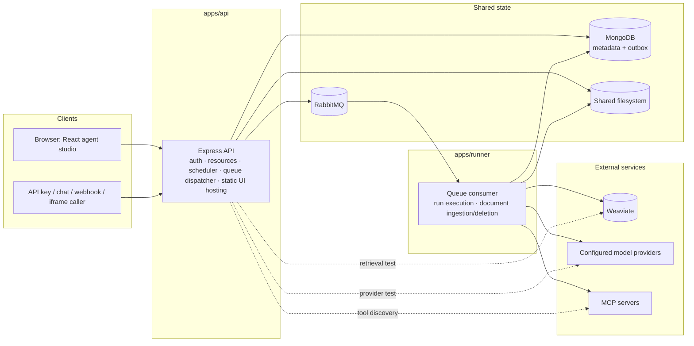
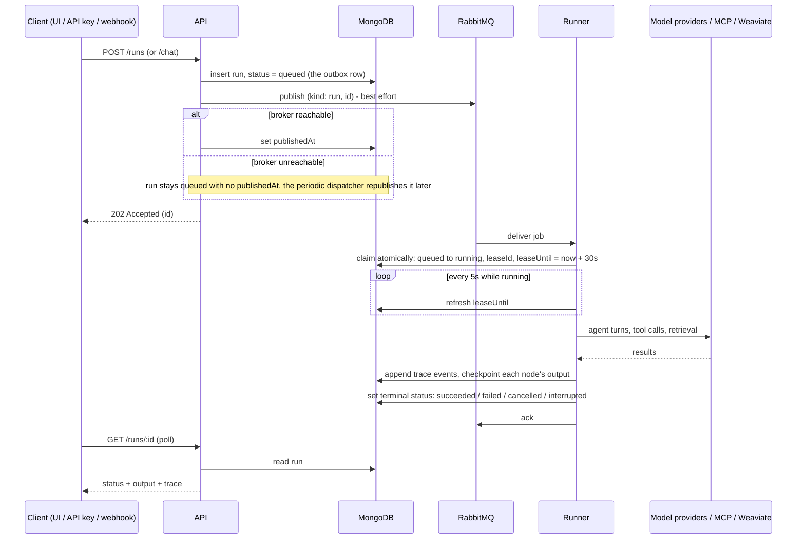
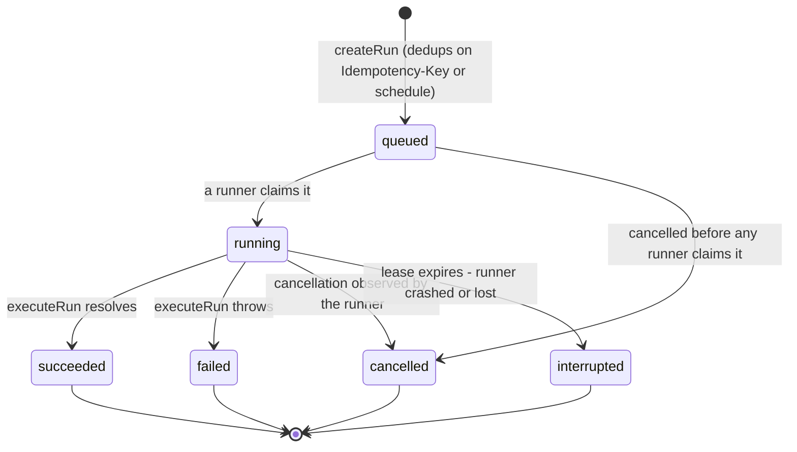
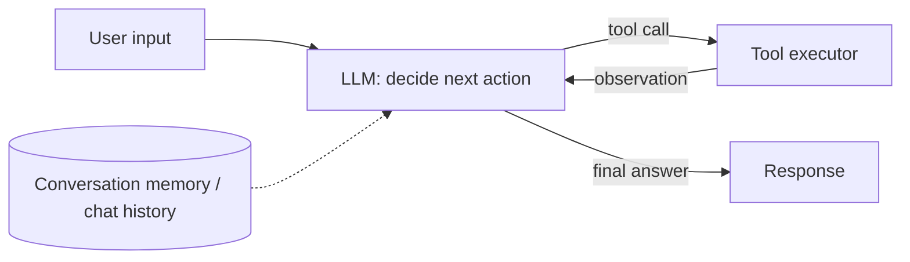
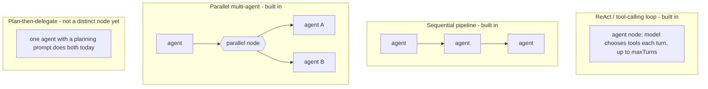

# Agentic Orchestration

A self-hosted studio for agents, MCP tools, and knowledge. Build visual workflows, run agents in a playground, and expose them through an API or an embedded conversation.

The application is self-contained. Its API, runner, studio, configuration, and deployment assets all live in this repository.

## Start

Install Docker with Docker Compose and OpenSSL, then run:

```sh
git clone https://github.com/deepfinery/orchestrator.git
cd orchestrator
./start.sh
```

Open **http://localhost:8088**. Create your local administrator account using the `SETUP_TOKEN` generated in `.env`. There is no default account or password. Subsequent starts use the same configuration and persistent volumes.

`start.sh` generates unique credentials, builds the application, starts Compose, and waits for healthy services. After configuration exists, you can also use:

```sh
docker compose up --build -d --wait
```

For a different port on first launch:

```sh
STUDIO_PORT=8090 ./start.sh
```

Allow approximately 4 GB of available memory for the application stack, plus the memory needed by any locally hosted models. A CPU-only laptop can run the studio with a remote model provider. Ollama or another inference server is configured separately; the project does not download a large model automatically.

## What is included

- **Agent studio:** instructions, descriptions, model choice, explicit tool permissions, multiple MCP connections, knowledge bindings, execution limits, and enable/disable controls.
- **Workflow harness:** explicit Start and Finish, inline agents, MCP tool and knowledge attachments, conditions, parallel agents, bounded cycles, and explicit MCP actions. Drag the labelled ports to connect components, reconnect or delete edges, undo/redo, auto-arrange, or edit/export YAML.
- **Runner:** durable RabbitMQ jobs, persisted execution snapshots and traces, bounded agent loops, cancellation, run history, and interval schedules.
- **One tool connector: MCP.** Streamable HTTP or legacy SSE, unauthenticated servers, bearer/API-key authentication, and OAuth discovery, PKCE, dynamic registration or a pre-registered client, and refresh tokens.
- **Model providers:** OpenAI-compatible APIs, Anthropic, Gemini, and Ollama. Model IDs and endpoints are configurable. Model providers are inference services; all external agent tools use MCP.
- **Knowledge bases:** filesystem uploads, asynchronous ingestion, Weaviate hybrid search, source citations in the prompt, and retrieval testing. TXT, Markdown, CSV, JSON, YAML, text PDFs, and DOCX are supported.
- **Shared workspaces:** MongoDB-backed local accounts, administrator-managed teammates, shared agents/workflows/tools/knowledge within a tenant, profile settings, tenant isolation, and workflow edit-conflict detection.
- **Integrations:** target-scoped API keys, persistent conversational API, authenticated JSON webhooks, and revocable iframe links with allowed frame origins.

No provider-specific tool connectors, external account login, website builder, business setup wizards, reports, customer management, product/service management, billing, or customer portal are included.

## Start with a template

Choose **Create workflow**, then **Knowledge research**, **MCP tool assistant**, or **Research and review**. Select or create your model provider and resources in the starter. You can discover MCP tools or upload knowledge files there, then open a connected canvas. **Blank canvas** starts with Start → Finish.

An agent's left/right ports control execution. Its bottom **Tools** and **Knowledge** ports attach resources available during its reasoning loop. Tools are not forced into the execution sequence: the model chooses when to call the tools you selected. Use an **MCP action** step when a specific call must happen in a fixed order. Clicking a palette item adds and connects it; dragging a port creates or replaces a connection. Select an edge and press Delete to disconnect it, or use the inspector. **Save & test** opens the workflow in the playground.

In **Settings → Team & workspace**, administrators can name the workspace and add teammates. Teammates share resources and run history. Model/MCP credentials stay write-only. Conversation histories are scoped to their initiating user or API key; workspace members can still inspect the shared execution history.

## First agent

1. In **Settings → Model providers**, add a provider, its API base URL, and a chat model ID. Add an embedding model if you want to use that provider for knowledge.
2. In **MCP connections**, save an MCP endpoint. Authorize it if required, then select **Discover tools**.
3. In **Agents**, define instructions, choose a model, and select the exact tools the agent may use. An empty tool selection grants no tool access.
4. Optionally create a **Knowledge base**, upload documents, wait for their `ready` status, and attach it to the agent.
5. Use the **Playground**, or add the agent to a workflow.

The studio starts without API keys. Actual model runs and vector embeddings require a configured provider. Local Ollama needs the selected models pulled in advance.

## Model endpoints

| Type              | Example base URL                                   | Notes                                                                                                                      |
| ----------------- | -------------------------------------------------- | -------------------------------------------------------------------------------------------------------------------------- |
| OpenAI compatible | `https://api.openai.com/v1`                        | Also supports compatible inference services such as vLLM and LM Studio. Supply that service's exact base URL and model ID. |
| Anthropic         | `https://api.anthropic.com/v1`                     | Chat/tool use. Select a different provider for embeddings.                                                                 |
| Gemini            | `https://generativelanguage.googleapis.com/v1beta` | Chat/tool use and configured embedding models. This is unrelated to UI login.                                              |
| Ollama            | `http://host.docker.internal:11434`                | Native Ollama chat and embedding APIs. The host gateway is configured in Compose.                                          |

Private endpoints are denied unless their hostname is explicitly listed in `ALLOWED_PRIVATE_HOSTS`. The default permits `host.docker.internal` and `ollama`. For an MCP server on your network, add its hostname to `.env` and recreate the API and runner:

```sh
docker compose up -d api runner
```

MCP OAuth callback URL: `PUBLIC_URL/api/mcp/oauth/callback`. Configure the public URL before authorizing a server. OAuth here authorizes tools; studio users always use local accounts. Servers without dynamic registration can use a pre-registered client ID and optional client secret. A remote stdio-only MCP server should be exposed through an HTTP/SSE MCP gateway; the application does not execute arbitrary shell commands supplied in the UI.

## API, conversation, webhooks, and iframe

Create an API key in **Integrations**, choosing its allowed agent or workflow. Then:

```sh
curl -X POST http://localhost:8088/api/runs \
  -H 'Authorization: Bearer YOUR_API_KEY' \
  -H 'Content-Type: application/json' \
  -H 'Idempotency-Key: a-unique-request-id' \
  -d '{"agentId":"YOUR_AGENT_ID","input":"Summarize the available knowledge."}'
```

The response is `202 Accepted` with an `id`. Poll `GET /api/runs/:id` using the same key. Terminal statuses are `succeeded`, `failed`, `cancelled`, and `interrupted`. Cancel with `POST /api/runs/:id/cancel`. Use `workflowId` instead of `agentId` for workflows.

For a conversation, call `POST /api/chat` with `workflowId` (or `agentId`) and `message`. Subsequent turns send the returned `conversationId` and a new `message`; history is maintained on the server. Each turn is queued and returns a run ID to poll.

For event-driven workflows, use **Integrations → Webhooks**. Choose a target and optionally a JSON input field such as `event.message`. Send JSON to the generated URL with its bearer secret. The input field becomes `{{input}}`; all event fields are available through `{{payload.field}}`. Poll `/api/hooks/:id/runs/:runId` with the same secret. Webhook retries support `Idempotency-Key`.

For iframes, choose **Integrations → Iframe embeds**, select one target, set exact allowed website origins and an expiration, then copy the generated HTML. The capability is carried in the URL fragment and sent as an authorization header by the embedded UI. No third-party login cookie is needed. Treat the embed link as a credential: it can run the selected target until revoked or expired. Allowed frame origins restrict where the UI may be framed; they do not make a copied capability secret.

See [the API reference](docs/api.md) for request shapes and permissions.

## Architecture

### Components



| Path            | Purpose                                                                                           |
| --------------- | ------------------------------------------------------------------------------------------------- |
| `apps/api`      | Local authentication, resource APIs, integrations, scheduler, queue dispatcher, static UI hosting |
| `apps/runner`   | RabbitMQ consumer, run leases, execution, document ingestion and deletion                         |
| `apps/studio`   | Trimmed React studio, workflow canvas, playground, knowledge and settings                         |
| `packages/core` | Shared schemas, agent runtime, provider adapters, MCP/OAuth, storage, retrieval, queue            |
| `tests`         | Unit, real-stack integration, fault-injection, and browser tests with test-only provider fixtures |

The dotted edges are administrative, not execution: the API calls a model provider directly only to verify credentials (`POST /providers/:id/test`), calls an MCP server directly only to list its tools (`POST /connections/:id/discover`), and calls Weaviate directly only for the Knowledge Base's inline retrieval test (`POST /knowledge/:id/search`). Every agent turn, workflow tool call, and document ingestion/deletion runs in the runner, reached only through RabbitMQ.

MongoDB, RabbitMQ, and Weaviate use their community distributions, run locally, and have independent persistent volumes. Only the studio HTTP port is published by the default Compose stack. No AWS, Google account login, S3, Redis, or managed database service is needed.

### Run lifecycle

Submitting a run and getting its result crosses the outbox, the broker, and a leased execution in the runner:



If the runner process dies mid-run, its message is never acked and its lease is never renewed. A periodic sweep (`recoverStaleJobs`) finds runs whose `leaseUntil` has passed and marks them `interrupted` once it does — no other replica resumes the run from its last checkpoint. See [Run states](#run-states) and [design notes](docs/design.md) for why.

### Run states



`interrupted` is terminal, not retried automatically: a tool call before the crash may already have taken effect, so replaying blind is unsafe. Review the run's trace and start a new run deliberately.

### Workflow node types

| Node type   | Behavior                                                                                   | Outgoing connections                                       |
| ----------- | ------------------------------------------------------------------------------------------ | ---------------------------------------------------------- |
| `start`     | Entry point of the workflow                                                                | one `next`                                                 |
| `agent`     | Runs an agent's bounded reasoning loop; the model chooses when to call its bound MCP tools | one `next`, plus bottom-port MCP tool / knowledge bindings |
| `tool`      | Makes one fixed MCP call with templated arguments, no model involved                       | one `next`                                                 |
| `parallel`  | Runs 2-8 agents concurrently on the same prompt and waits for all                          | one `next`                                                 |
| `condition` | Evaluates a templated comparison                                                           | `onTrue` and `onFalse`                                     |
| `output`    | Renders a template from accumulated state and ends that path                               | none - terminal                                            |
| `finish`    | Same as `output`; the canonical end of a workflow                                          | none - terminal                                            |

For example, the **Research and review** starter wires two agents and a knowledge binding like this:


An agent's bound MCP tools and knowledge bases are available throughout its own turn budget, not fixed steps in the graph; a `tool` node is for a call that must happen in a fixed order outside any agent's reasoning.

## Design rationale

### Idempotency, resiliency, and what "handled" actually means

Three distinct guarantees exist today, and one deliberately doesn't:

- **Submission idempotency.** `POST /runs` and webhook deliveries accept an `Idempotency-Key`. The same key with the same payload returns the original run; the same key with a different payload is rejected with `409` (`createRun` in `packages/core/src/runs.ts`). Scheduled workflows dedup the same way on a `scheduleKey`, so a scheduler restart cannot double-fire an interval.
- **Durable delivery (the outbox).** A run is written to MongoDB with `status: queued` _before_ anything is published to RabbitMQ. If the broker is down at that instant, the write still succeeds, and a periodic dispatcher (`dispatchPending`) republishes it once the broker is reachable again. No run is lost to a broker outage — the fault-injection test in `tests/integration/reliability.test.ts` stops the RabbitMQ container mid-submission to verify exactly this.
- **Exclusive execution.** A runner claims a run with an atomic `findOneAndUpdate` (`queued` → `running`, tagged with a `leaseId`). A duplicate delivery of the same message finds the run already claimed and no-ops instead of executing it twice. A 5-second heartbeat keeps the lease alive; if the runner process dies, the lease simply stops renewing.

What is **not** built is automatic replay of a crashed run from its last checkpoint. The runner does checkpoint every node's output to MongoDB as it goes (see [Run lifecycle](#run-lifecycle)), but those checkpoints exist for inspection and for a fast `interrupted` verdict — they are not proof that resuming is safe. MCP defines no generic way to ask "did that tool call already take effect?" A blind replay risks doing it twice (sending a second email, filing a duplicate ticket); silently skipping it risks not doing it at all. Neither is a decision this platform makes on an operator's behalf, so a run whose lease expires is swept to a terminal `interrupted` state with an error pointing at the trace, instead ([Run states](#run-states)).

Real saga-style recovery — automatically resuming past the point of failure — needs one of two things this platform does not yet assume: either every MCP tool call carries an idempotency key that the _external_ service itself honors (outside this platform's control; MCP has no standard for it), or each workflow node declares an explicit compensating action to undo its effect. Both are real, scoped follow-up work. `docs/design.md`'s "Queue semantics" section documents the current stance as a deliberate design decision, not an oversight.

### Why this design holds up

- **One tool protocol, not N connectors.** Search, ticketing, file access, and any other external capability arrive through MCP. That means one auth model (bearer or OAuth with PKCE), one discovery mechanism (`listTools`), and one place — `toolValidation.ts` — where every tool call is checked against the server's own live schema before it is dispatched. A new integration is a new MCP server, not new orchestrator code.
- **Durable by construction.** The outbox → broker → lease → heartbeat chain means a client's dropped connection, a broker restart, or a runner crash cannot silently lose a submitted run. This is exercised, not assumed: the isolated test stack actually kills the RabbitMQ container and `SIGKILL`s the runner mid-run.
- **Bounded everywhere.** Agent turns, per-turn tool-call counts, run step budgets, context size, and wall-clock timeouts are all capped (`agent.maxTurns`, `workflow.maxSteps`, a 30-minute worker limit). An agent cannot run away with your token budget or your infrastructure.
- **Least privilege by default.** An agent's tool access is an explicit allow-list (`agent.connections[].tools`); an empty list grants nothing. Provider and MCP credentials are write-only, even to administrators.
- **Tenant isolation at the execution layer, not just the UI.** `ownerId`/tenant scoping is enforced in the same resource-lookup functions the runner calls to execute a job — a misconfigured or compromised agent cannot read another tenant's connections or knowledge base.
- **Tested against real infrastructure.** Integration tests run against real MongoDB, RabbitMQ, and Weaviate containers with deterministic MCP/model fixtures, including fault injection — killed containers, expired OAuth tokens, interrupted runs. A passing suite here means the failure mode was actually exercised, not asserted away with a mock.

### Agentic architecture in context

This project does not use LangChain, or any agent framework — there is no such dependency in `package.json`, and `packages/core/src/runtime.ts` talks to each model provider's native API directly. It's still useful to place this design against the architecture most agent frameworks (LangChain's `AgentExecutor` and its equivalents elsewhere) converge on, since the same tradeoffs apply either way:



_A generic ReAct-style agent-executor loop — the common shape behind LangChain and most other agent frameworks, shown here as background, not as this repository's own stack._

That loop's benefits are real: a large ecosystem of pre-built tool, memory, and retriever integrations; a shared vocabulary (chains, agents, tools, memory) that's easy to hire and reason about; and fast prototyping. Its costs are just as real for a long-lived, self-hosted product: a fast-moving dependency with frequent breaking changes, an abstraction layer between the developer and the provider's actual request/response, and no built-in opinion about durability, multi-tenancy, or credential handling — that part gets built regardless of the framework underneath. This project takes the other side of that trade: a small, dependency-light execution core purpose-built around the durability, tenancy, and tool-validation guarantees described above, in exchange for not inheriting a framework's integration catalog. MCP is the integration catalog instead.

**Agentic patterns, and what this platform supports today:**



The `agent` node already runs a bounded ReAct loop, `next` edges already chain agents into a sequential pipeline, and the `parallel` node already fans one prompt out to 2-8 agents and waits for all of them. A dedicated **planner** pattern — a step that decomposes a task and explicitly dispatches named sub-steps to specialized agents — is not its own node type yet; today it is approximated by writing a planning instruction into a single agent's system prompt. That gap is open backlog, not shipped.

### The agent and tool design, in depth

Zooming into `packages/core/src/runtime.ts` and `mcp.ts` — the parts of this platform that decide what an agent is allowed to do and how it does it:

- **The tool-calling loop is explicit and inspectable.** Each turn, the model sees the full tool list with live schemas, picks zero or more calls, each call is validated locally against that schema before dispatch, and every call and result is written to the run's event log as it happens rather than reconstructed afterward. That log is what the Playground's trace and the Executions page render.
- **Tool errors are recoverable, not fatal.** A schema violation or an MCP-side error is handed back to the model as a normal tool result (marked `tool_error`) so it can retry with corrected arguments inside its existing turn budget — instead of one bad call, like the Tavily `topic` enum mismatch that motivated this fix, taking down the entire run.
- **Every tool call happens inside a lease.** Tool calls only ever run inside a claimed, heartbeating run; if the runner dies mid-call, no other replica can also be mid-call on the same run, and the run fails safe to `interrupted` instead of silently continuing from stale state.
- **Retrieval is a context stage, not a tool the model can misuse.** Knowledge lookups happen before the model sees the prompt, are cited by source title, and are explicitly labeled as reference data rather than instructions in the system prompt — the model cannot be tricked into treating retrieved text as a new instruction the way an ungoverned RAG-as-a-tool integration can be.
- **Nothing here trusts the model's judgment for authorization.** Which tools exist, which knowledge base is searched, which tenant's data is reachable, and how many turns or tool calls are allowed are all decided by configuration before the model runs, never requested by the model at run time.

Why this matters in production, specifically: the failure modes above are not hypothetical — they are the exact shape of the bugs reported against this platform, such as a bad tool argument crashing an entire customer-facing run, or no visibility into whether a crashed run's side effects already happened. A framework or a hand-rolled prototype that skips schema validation, run leasing, or explicit tool grants will work in a demo and then produce exactly these incidents the first time a tool's schema drifts, two workers race on the same job, or an agent is given more trust than the person configuring it intended. Durability, least privilege, and schema validation are not polish layered on top of the agent loop — for a system that lets an LLM take real external actions, they are the difference between a demo and something a customer's workflow can safely run behind.

## Operations and limits

- Keep `.env` backed up with the volumes. In particular, existing encrypted credentials cannot be recovered without `ENCRYPTION_KEY`.
- The `files` volume is mounted at `/data` in both the API and runner. For a mounted shared filesystem, use [compose.shared-fs.yaml](compose.shared-fs.yaml).
- The default HTTP listener binds to loopback. For a server, put a TLS reverse proxy in front of it and set `PUBLIC_URL` to the HTTPS URL. Set `TRUST_PROXY=1` only when there is exactly one trusted proxy.
- Scale runners with `docker compose up -d --scale runner=2`. Keep the same database, broker, Weaviate instance, credentials, and filesystem for all replicas.
- A Mongo run/document record is the durable outbox. Queue deliveries are at least once. Atomic claims prevent two workers from executing the same active run.
- A run interrupted during external work is marked **interrupted**, not automatically replayed. A tool may have acted before the process was lost. Review the trace and start a new run deliberately. This is not an exactly-once guarantee for external side effects.
- Agent tool errors are returned to the model for correction within its turn budget. An explicit workflow tool error fails that run. There is no automatic retry of a potentially mutating MCP tool.
- Harness workflows have one Start and at least one Finish. Every execution step needs a possible path to Finish. Cycles are permitted with a step budget (default 100, maximum 500); a run fails when it exhausts that budget. Agent turns and timeouts are bounded separately. Template bindings support `input`, `last`, `steps.<id>`, and `payload.<field>`; arbitrary code is not evaluated. Legacy graphs remain runnable and are upgraded visually when opened and saved.
- Parallel agent steps wait for all agents. A failed sibling aborts the others' in-flight requests; it cannot undo completed external actions.
- Interval schedules dispatch while the API is running. After downtime, an overdue schedule dispatches once; it does not replay every missed interval.
- Knowledge indexing is retriable and replaces partial document vectors. Changing the embedding configuration of a provider already bound to a knowledge base is blocked; create a new provider/base instead.
- Scanned PDFs/images need OCR before upload. Extraction is limited to 2 million characters and 4,000 chunks per document; oversized documents fail explicitly. The default upload limit is 20 MB.
- Run history and documents persist until you remove them or their volumes. Backups and retention are the installation operator's responsibility.

See [operations](docs/operations.md) for backup and recovery, and [design notes](docs/design.md) for the architecture and execution guarantees.

## Upgrade

Back up your configuration and volumes, then run `git pull --ff-only` and `./start.sh` from your clone. Existing private accounts keep separate workspaces and their data; the upgrade does not automatically share previously private credentials. New teammates created by a workspace administrator join that administrator's workspace. See [upgrade details](docs/operations.md#upgrading-to-02).

## Development and verification

Node.js 22 or later is required outside Docker.

```sh
npm ci
npm run typecheck
npm test
npm run build
```

Run the complete isolated-stack suite (creates and removes **test-only** Compose volumes):

```sh
./scripts/test-stack.sh
```

Include Chromium browser tests:

```sh
npx playwright install --with-deps chromium
BROWSER_TESTS=1 ./scripts/test-stack.sh
```

On Linux, `BROWSER_TESTS=container ./scripts/test-stack.sh` runs Chromium in
the matching Playwright container instead of installing browser system libraries.

For UI development against the running local Compose API, use `npm run dev` and
open `http://localhost:5173`. For a non-default API URL, set `DEV_API_URL` and
`DEV_API_ORIGIN` to its reachable endpoint and configured public origin. Direct
API/runner development requires explicitly supplying the configuration in
`packages/core/src/config.ts` and reachable development database/broker URLs.

The fixtures provide deterministic model, MCP, and OAuth endpoints. MongoDB, RabbitMQ, Weaviate, the API, and the runner are real containers. Tests exercise protocol plumbing, queue recovery, and access isolation; hosted models and your particular external MCP services should also be checked with their real credentials before release.

The GitHub Actions workflow builds and tests every push and pull request. Installation credentials are generated locally; `.env`, data, dependency folders, and test artifacts are excluded from version control.

## License

Apache License 2.0. See [LICENSE](LICENSE) and [NOTICE](NOTICE). Third-party packages and container images retain their respective licenses.
