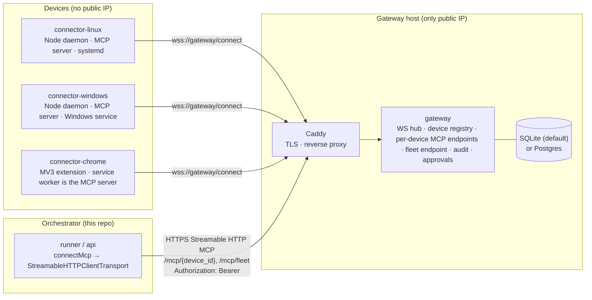
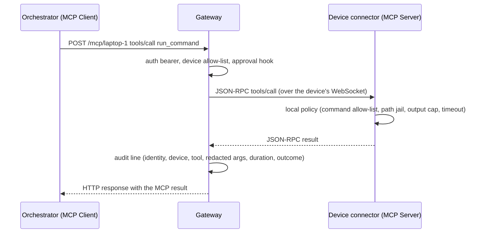
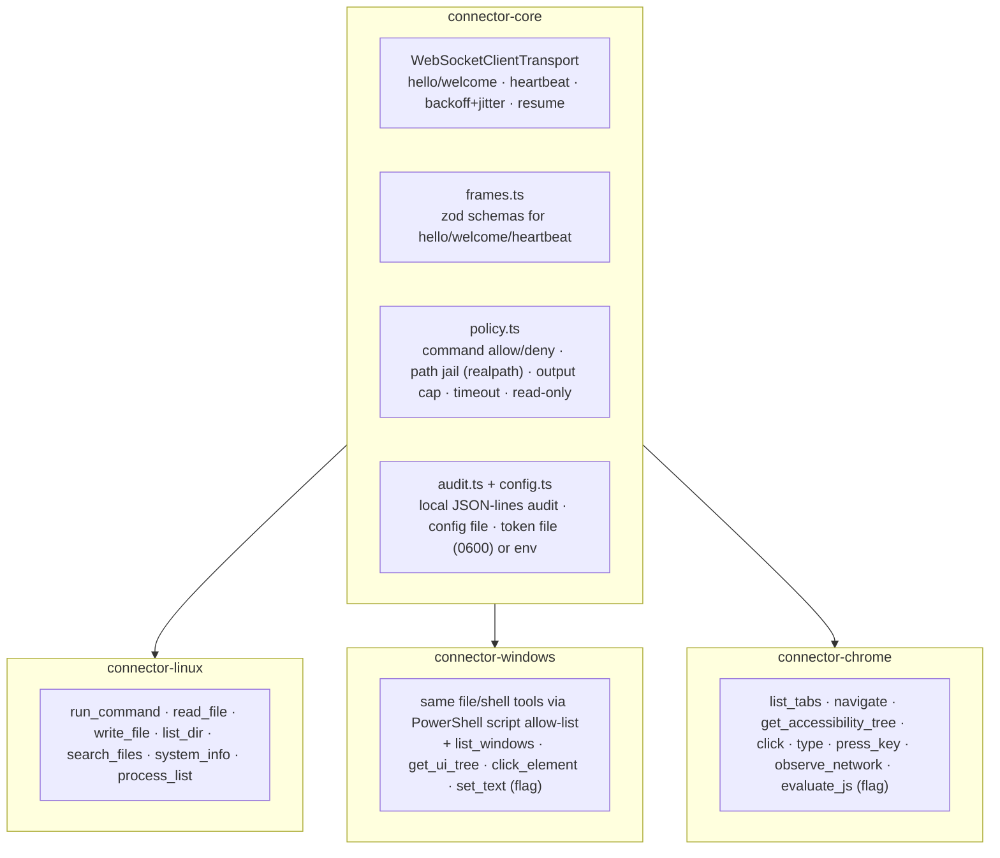

# Device gateway — architecture

How the orchestrator in this repository controls machines that have no public IP: Linux hosts,
Windows hosts and Chrome browsers. Devices dial **out** to a gateway over WebSocket; the orchestrator
talks to each device as an ordinary MCP server through the gateway. Nothing in the orchestrator's
tool-calling path changes.

Companion documents: [PROTOCOL.md](PROTOCOL.md) (wire format), `SECURITY.md` and `INSTALL.md`
(written with their phases).

## What the orchestrator already does

| Fact                       | Where                                                                                                                                                                                                                                                                                                                                                  |
| -------------------------- | ------------------------------------------------------------------------------------------------------------------------------------------------------------------------------------------------------------------------------------------------------------------------------------------------------------------------------------------------------ |
| Runtime                    | Node.js ≥ 22, TypeScript (ESM, `module: NodeNext`), npm with `package-lock.json`. Single root `package.json`; `tsconfig.server.json` compiles `apps/api`, `apps/runner`, `packages/core` to `dist/`. Docker image `node:22-alpine`.                                                                                                                    |
| MCP SDK                    | `@modelcontextprotocol/sdk` **1.30.1** (pinned).                                                                                                                                                                                                                                                                                                       |
| MCP client & transports    | `packages/core/src/mcp.ts` → `connectMcp()` builds a `Client` with `StreamableHTTPClientTransport` (default) or `SSEClientTransport`, a guarded `fetch` (`safeFetch`, 60 s deadline, private-network rules) and either a static header (`authType: token`, header name configurable, `Authorization` → `Bearer <t>`) or OAuth (`StoredOAuthProvider`). |
| How servers are registered | The `connections` collection (`connectionSchema` in `packages/core/src/schema.ts`): `name`, `url`, `transport` (`http`/`sse`), `authType` (`none`/`token`/`oauth`), `tokenHeader`, `enabled`. Tools are discovered with `POST /api/connections/:id/discover` and stored on the record; agents get an explicit per-connection allow-list.               |
| Tool dispatch              | `packages/core/src/runtime.ts`: the agent loop validates arguments (`validateToolArguments`) and calls `session.client.callTool({ name, arguments, _meta: { idempotencyKey } })`; the explicit `tool` workflow step does the same for one fixed call. These two sites are where a **policy hook** slots in later.                                      |
| URL rules                  | `validateRemoteUrl()` in `packages/core/src/security.ts` rejects private/link-local addresses unless the hostname is in `ALLOWED_PRIVATE_HOSTS` (default `host.docker.internal,ollama`). A gateway on a public hostname needs nothing; a LAN-only gateway must be listed there.                                                                        |

Consequence: a gateway device endpoint (`https://<gateway>/mcp/<device_id>`) can be added **today** as a
connection with `authType: token` and no orchestrator code change. The integration work is about
convenience (fleet discovery) and defence in depth (policy hook), not about making it work.

## Components



Data flow for one tool call:



### Repository layout

The components are **standalone npm packages** with their own pinned `package.json`, so a connector
installs on a device without the orchestrator's dependency tree, and the existing Docker build of the
orchestrator is untouched. Root scripts wire them into `npm run typecheck` / `npm test`.

```
gateway/             service (Node 22 + TypeScript, Express 5, ws, MCP SDK 1.30.1)
connector-core/      shared TypeScript library: WS transports, framing, auth, reconnect, policy, audit
connector-linux/     Node CLI daemon + systemd unit + install.sh
connector-windows/   Node CLI daemon + service wrapper + install.ps1
connector-chrome/    Manifest V3 extension (esbuild bundle of connector-core + MCP SDK)
docs/                ARCHITECTURE.md · PROTOCOL.md · SECURITY.md · INSTALL.md
packages/core/       orchestrator: toolPolicy.ts hook + gateway fleet sync (phase 6)
```

`connector-core` is consumed through `file:../connector-core` dependencies (npm symlinks it), and
bundled into the Chrome extension with esbuild. Node ≥ 22 provides a standards-compliant global
`WebSocket`, so the **device-side transport uses the browser `WebSocket` API in Node and in Chrome
alike**; only the gateway needs the `ws` package (for the server side).

## Gateway

### Two MCP faces, one SDK

The gateway does not invent an RPC layer. It is an MCP **client** towards each device and an MCP
**server** towards the orchestrator, both built from the SDK:

- Towards devices: one `WebSocketServerTransport` (custom `Transport` from `connector-core`) per
  accepted socket, driving one SDK `Client`. The gateway sends `initialize` once per connection and
  keeps the client for the life of the socket.
- Towards the orchestrator: one SDK `Server` + `StreamableHTTPServerTransport` per device endpoint
  session. Its request handlers forward to the device client:
  - `initialize` is answered by the gateway (server info `agentic-gateway`, capabilities `tools`,
    `listChanged`), so the endpoint exists even while the device is offline.
  - `tools/list` → `deviceClient.listTools()` filtered by the device's `allowed_tools`.
  - `tools/call` → allow-list check → approval hook → `deviceClient.callTool(params, { timeout })`.
  - Anything else the device advertises (`resources/*`, `prompts/*`) is passed through unchanged;
    device-initiated requests (sampling, elicitation) are answered with `-32601` at the gateway.

Because every orchestrator session has its own `Server` and every device its own `Client`, JSON-RPC
ids never collide across sessions: the SDK owns id generation and correlation on both sides. Per-request
timeouts are the SDK's `RequestOptions.timeout` (default 120 s, per-tool override), and
`notifications/cancelled` propagates through the SDK's `AbortSignal` plumbing.

### HTTP surface

| Path                                                                                                       | Purpose                                                                                                                 |
| ---------------------------------------------------------------------------------------------------------- | ----------------------------------------------------------------------------------------------------------------------- |
| `GET /connect`                                                                                             | WebSocket upgrade for devices (subprotocol `agentic-mcp.v1`). Authentication is the first frame, never a query string.  |
| `POST/GET/DELETE /mcp/{device_id}`                                                                         | Streamable HTTP MCP endpoint for one device. Requires `Authorization: Bearer <orchestrator token>`.                     |
| `POST/GET/DELETE /mcp/fleet`                                                                               | Streamable HTTP MCP endpoint with `list_devices` and `device_status` tools.                                             |
| `POST /admin/devices`, `GET /admin/devices`, `DELETE /admin/devices/{id}`, `PUT /admin/devices/{id}/tools` | Enrollment and allow-list management; admin bearer token. The CLI (`gateway enroll …`) uses the same code path locally. |
| `GET /healthz`, `GET /readyz`                                                                              | Liveness (process up) and readiness (database reachable).                                                               |

### Registry

```sql
devices(
  device_id     TEXT PRIMARY KEY,   -- [a-z0-9][a-z0-9-]{0,62}
  token_hash    TEXT NOT NULL,      -- argon2id
  platform      TEXT NOT NULL,      -- linux | windows | chrome
  allowed_tools TEXT NOT NULL,      -- JSON array, empty by default
  owner         TEXT NOT NULL,
  created_at    TEXT NOT NULL,
  last_seen     TEXT,
  disabled      INTEGER NOT NULL DEFAULT 0
)
```

SQLite through Node's built-in `node:sqlite` (no native dependency, file under `GATEWAY_DATA_DIR`);
`DATABASE_URL=postgres://…` selects the Postgres backend behind the same repository interface.
Connection state (online, session, capabilities) lives in memory; `last_seen` is persisted on connect,
on every heartbeat minute and on disconnect.

### Cross-cutting concerns

- **Orchestrator auth** — `GATEWAY_API_TOKENS="name:token,name2:token2"`; the name is the identity
  written to the audit log. Tokens are compared in constant time. mTLS later: Caddy terminates TLS with
  `client_auth`, forwards `X-Client-Cert-Subject`; the gateway honours it only when
  `GATEWAY_TRUST_PROXY_CLIENT_CERT=true`.
- **Per-device allow-list** — enforced on `tools/list` (filtered) and `tools/call` (rejected with
  `-32011`), independent of whatever the connector enforces. A freshly enrolled device has an empty
  list.
- **Audit log** — one JSON line per tool call to `GATEWAY_AUDIT_FILE` (or stdout):
  `{ts, identity, device_id, tool, args, duration_ms, outcome: ok|error|denied|timeout|offline, error?}`.
  Arguments pass through a redaction hook (`redactArguments(tool, args)`, default: values of keys
  matching `/pass(word)?|secret|token|key|authorization/i` become `"[redacted]"`, strings over 2 kB are
  truncated).
- **Approval hook** — `GATEWAY_APPROVAL_TOOLS=run_command,write_file` names tools that need a decision
  from an `ApprovalProvider` before forwarding. Shipped: `noop` (allow) and `webhook` (POST the pending
  call to `GATEWAY_APPROVAL_URL`, then poll `GET <url>/<approval_id>` until `approved|denied` or
  `GATEWAY_APPROVAL_TIMEOUT` (default 300 s → denied)).
- **Logging** — JSON lines with `level`, `msg`, `device_id`, `session_id`, `request_id`; tokens never
  logged.
- **Deployment** — `gateway/Caddyfile` terminates TLS on the public hostname (`GATEWAY_PUBLIC_HOST`,
  placeholder `gateway.example.com`), proxies `/connect` as WebSocket and everything else as HTTP to the
  gateway on the loopback interface. A `gateway/compose.yaml` runs gateway + Caddy; the orchestrator's
  own Compose file is unchanged.

## Connectors

Every connector is an ordinary MCP server (`McpServer` from the SDK) with tools, plugged into the
`WebSocketClientTransport` from `connector-core`. The same server can be started with `--stdio` for MCP
Inspector, which is how each connector is verified on its own.



Local policy is applied **inside the tool functions**, so it holds even if the gateway is compromised:

- `run_command` — argv allow-list (exact program names) and deny-list, no shell by default (`spawn`
  without `shell: true`; an explicit `shell: true` mode is opt-in per config), cwd forced inside the
  work directory, per-command timeout, output capped at `max_output_bytes` with a truncation marker.
- File tools — every path resolved with `realpath` (after creating parents for writes) and required to
  stay under the work directory; symlinks that escape are rejected; `read_only: true` disables
  `write_file` and mutating commands.
- Windows — commands run through `powershell -NoProfile -NonInteractive -File <script>` where the
  script must come from the connector's `scripts/` allow-list; UI Automation tools are behind
  `ui_automation: true` and use a bundled PowerShell script over `System.Windows.Automation`.
  Documented limitation: a Windows _service_ runs in Session 0 and cannot see the interactive desktop;
  for UI Automation the connector is registered as a logon scheduled task in the user session, and
  UIPI still blocks elevated windows.
- Chrome — tools operate only on tabs whose origin is on the per-site allow-list from the options page;
  `evaluate_js` is off unless enabled there; `observe_network` uses `chrome.debugger` Network events with
  bodies never captured. The service worker is kept alive by WS traffic (heartbeat every 30 s keeps it
  under Chrome's idle limit) with a `chrome.alarms` reconnect fallback.

Connectors never treat tool output as instructions: output is returned as MCP content, and nothing in
a result can change the connector's configuration, allow-lists or token.

## Orchestrator integration (phase 6)

1. **Static entries** — a device endpoint is a connection: `url = https://<gateway>/mcp/<device_id>`,
   `transport = http`, `authType = token`, `tokenHeader = Authorization`. Works unchanged.
2. **Fleet discovery** — the fleet endpoint is added once as a connection; a new
   `POST /api/connections/:id/sync-fleet` calls its `list_devices` tool and creates or updates one
   connection per device (`gateway:<device_id>` naming, same token, `managedBy` field), then runs
   discovery on each. The Connections page gets a **Sync devices** button on fleet connections.
3. **Policy hook** — `packages/core/src/toolPolicy.ts` exports
   `beforeToolCall({ ownerId, runId, connectionId, tool, arguments }) → { allow, reason? }`, called at
   both dispatch sites in `runtime.ts` before `callTool`. Default implementation allows everything;
   it exists so tenant-level rules (deny tools by name, require approval) can be added without touching
   the loop again.

## Failure modes

| Situation                       | Behaviour                                                                                                                                                                                |
| ------------------------------- | ---------------------------------------------------------------------------------------------------------------------------------------------------------------------------------------- |
| Device offline                  | `/mcp/{id}` still answers `initialize`; `tools/call` returns JSON-RPC error `-32010 device offline`; `tools/list` serves the last known list with `_meta.stale: true` when available.    |
| Device reconnects mid-call      | In-flight calls fail with `-32014 device reconnected`; nothing is replayed (a tool may already have acted). The orchestrator's `idempotencyKey` in `_meta` reaches the device unchanged. |
| Two sockets for one device      | The newer session wins; the older is closed with code `4009`.                                                                                                                            |
| Orchestrator token invalid      | HTTP 401 before any MCP processing.                                                                                                                                                      |
| Tool not allowed for the device | JSON-RPC error `-32011`, audited as `denied`.                                                                                                                                            |
| Approval denied / timed out     | JSON-RPC error `-32012`, audited as `denied`.                                                                                                                                            |
| Per-request timeout             | JSON-RPC error `-32013`; `notifications/cancelled` sent to the device.                                                                                                                   |
| Gateway restart                 | Devices reconnect with backoff; orchestrator sessions are re-established by its transport on the next request.                                                                           |

## Testing

- **Unit** (`connector-core`, `gateway`): frame validation, backoff schedule with fake timers, resume
  handling, path jail with symlinks, command allow/deny, redaction, allow-list filtering.
- **Integration** (`gateway/test`): start the gateway on a random port, start `connector-linux` against
  it (in-process), connect an SDK `Client` over Streamable HTTP as the orchestrator would, and assert
  `list_devices`, `tools/list` filtering, `run_command` end to end, denial and offline behaviour.
- **NAT simulation** (`scripts/simulate-nat-device.sh`): runs the connector in a container on an
  isolated Docker network with no published ports and `--cap-drop ALL`; only outbound traffic to the
  gateway is possible, which is the production situation.
- **Orchestrator end-to-end** (phase 6, `tests/integration`): register the gateway as a connection in
  the isolated test stack and run a workflow whose agent calls `run_command` on the Linux connector.

## Phases

1. Docs (this file, PROTOCOL.md) → plan review.
2. `connector-core` + `connector-linux` with `--stdio`; verify with MCP Inspector.
3. Gateway with one hard-coded device, end to end.
4. Registry, enrollment CLI/admin API, orchestrator auth, per-device endpoints, fleet endpoint, audit.
5. `connector-windows`, then `connector-chrome`.
6. Orchestrator: fleet sync, policy hook, end-to-end test through the isolated stack.
7. Test suite and NAT simulation script; SECURITY.md and INSTALL.md finalised.
